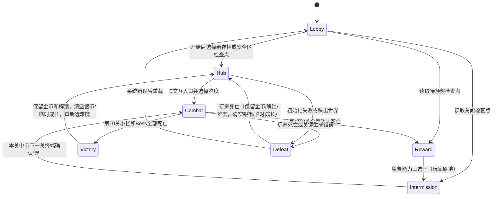

# 十关推进、安全区、敌人与经济

## 目的和设计

十关的战斗密度逐步变化，前九关提供“战斗 → 原地清关 → 免费能力选择 → 本关中心终端升级 → 主动进入下一关”的节奏；普通关随机近战/冲刺，第5关近战/冲刺/远程三种小怪，第10关三种小怪加Boss。无尽按每5关加入远程、每10关追加Boss重复。前九关清关不传回安全区、不更改玩家朝向。金币用于安全区升级、银币用于战斗关卡清场后的原地终端升级。通关、死亡和主动放弃均清空银币及临时升级属性，保留金币余额、金币永久成长/价格与武器解锁；通关回安全区可继续更高难度。已有存档恢复最近检查点，旧Victory档也按新规则结算至Hub。所有购买必须通过真实物体交互。表字段见[战役配置与难度](战役配置与难度.md)，暂停和持久化见[检查点存档](暂停设置与检查点存档.md)。

默认地图现为 Blender 制作的 `L_ThreeSector_Whitebox`：安全区中心 `(-6000,0,10000)`，战斗区中心 `(0,0,10000)`、`(6000,0,10000)`、`(12000,0,10000)`（cm）。各区约 34m 方形地面、2.4–5m 围墙；同图传送推进，没有独立关卡加载。`BuildAreas` 验证四区标签后使用已有白模；原模板 `FirstPersonMap` 仍回退为 C++ 生成几何。模型、碰撞、坐标和重导入见 [白模场景](Whitebox.md)。

## 流程与接口

`GameMode::InitGame`强制指定原生Pawn/PS/PC/GS/HUD，因为旧模板BP_GameMode存有旧类引用。`StartPlay`加载配置并显示图片背景大厅，冻结角色；开始按钮现在打开三栏存档页。创建或选择成功才OpenLevel，新World由`RestoreCheckpoint`调用`StartRun`校验表、创建干净安全区，再恢复保存的阶段与数值。大厅复用同一白模地图，没有独立地图资产。要换自定义蓝图派生类，需同步`InitGame`的默认类覆盖策略。

`StartNextLevel` 验证 Hub/Intermission、升级菜单与出发确认框均已关闭、玩家和区域存在，解析下一关配置及难度，销毁当前两个终端，编号 +1 后按 ArenaIndex 传送并生成敌人。终端经控制器确认后才调用该权威接口；自动化测试可直接调用接口准备测试世界，但生产交互不绕过确认。属性写入 GAS，实例保存怪物等级和银币快照。`NotifyEnemyKilled` 拒绝活怪/未注册/重复回调，先从弱引用集合移除再奖励。集合归零通过下一帧 `FinishLevel` 推进，UI 不判断清关条件。

前九关清场后停止玩家残余速度，保持位置和视角，调用 `RefillPlayer` 沿用满血/满弹补给规则；在当前 ArenaIndex 的地面中心创建两个终端，然后弹出免费奖励菜单。选完进入 Intermission，恢复移动，玩家自行靠近终端。第五关三种小怪清场也走此流程；固定战役第十关击杀Boss与全部小怪后直接Victory，没有无效的“第十一关”入口；无尽第十关仍继续备战。

`SpawnTerminals(Center)` 负责成对创建，`ClearTerminals` 负责成对销毁；World 同时最多存在一对由本模块管理的终端。升级终端默认 XY 偏移 `(0,-300)`、下一关终端 `(0,300)` cm；各点向下检测实际地面（忽略玩家），高度为命中面 +81cm（碰撞半高 80cm +1cm 容差），兼容安全区 5cm 高台面。终端使用独立 Box 根碰撞，显示圆柱不参与碰撞；引擎在玩家占位时微调终端，玩家本身不传送。`GetShopTerminal/GetNextLevelTerminal` 是当前对象的借用入口；交互必须与 GM 注册引用一致，防止旧终端或自行生成的副本绕过进度。Reward 未选完、商店打开、距离超过 250cm 均不能通过入口跳关。

玩家死亡（包括掉出世界）先标记死亡原因、清空当前银币，再立即把活动槽重置为新的Hub检查点：保留当前金币、创建时间与难度、金币永久属性/价格、实际主武器/持有库存及主副槽选择；银币及银币价格/免费技能奖励归零。`SaveResetCheckpoint`采集当前装备，按基础容量加永久弹匣加成补给，不继承临时容量。死亡页直接退出或返回大厅也先重试保存，因此不能靠读档找回死亡前的临时成长与银币。确认重开后OpenLevel创建新PS/ASC/Pawn并恢复保存的配装，主枪无需重新装备；武器解锁档案不变。无活动槽的开发World使用GI持有的一次重开快照恢复永久成长与配装，不写磁盘；与正式槽同走ResumeRun流程。主武器持久化细节及验证见[武器库与玩家存档](武器库与玩家存档.md)。

第十关清场才读取当前锁定难度的`VictoryGoldReward`，先切换Victory再发金币，重复清场回调会被阶段检查拒绝。前九关金币不变。随后记录通关解锁、调用`ResetCompletedRunGrowth`：将GAS合计恢复为基础值加金币永久增量，银币/免费关卡成长与银币价格清零，满血/基础容量加永久容量补给；金币余额、永久属性和金币逐项价格保留。保存后的Victory下次读取转Hub，不再触发金币发放。`ContinueAfterVictory`幂等记录旧RunId、创建安全区终端、编号归0、新RunId后保存。武器库存保留；系统错误保留最近检查点。

## 配置

### 下一关出发确认

目的：让玩家明确决定出发。安全区入口显示三档难度，前九关清关入口显示是/否；共用距离验证和待确认请求，不新增复制阶段。弹窗期间仍为Hub/Intermission，不生成敌人、不扣金币、不清理终端。

1. 距当前下一关终端不超过 250cm 时按 E，`ADemoInteractable::Interact` 验证阶段、终端身份及菜单互斥，调用 `ADemoPlayerController::OpenNextLevelConfirmation`。
2. 控制器保存终端弱引用和已完成关卡编号，停止移动/射击，显示鼠标并锁定输入；`DrawNextLevelConfirmation`在Hub显示Easy/Normal/Hard，关间显示目标编号及是/否。
3. “否”或 Tab 调用 `CancelNextLevelConfirmation`，丢弃待确认请求并恢复控制；关卡、玩家位置、金币和升级保持原状，可再次交互或继续购买。重复按 E 不会确认。
4. 关间“是”/Enter或Hub难度按钮调用`ConfirmNextLevel`，重新验证拥有者、阶段、关卡、终端身份和距离。Hub未明确选难度时Enter拒绝。合法时先消费请求，再`StartNextLevel`，先保存出发检查点后清理终端；配置/生成失败走原结算流程。
5. 距离变化、终端失效或旧关卡请求会被拒绝并关闭弹窗；死亡/大厅切换主动丢弃请求，残留按钮点击无效。弱引用不会延长终端生命周期，也不会跨 OpenLevel 持有旧世界对象。日志搜索 `NEXT_LEVEL` 可追踪打开、拒绝、关闭和确认；函数入口按项目规则埋点。

使用与维护：不需要新建 UMG 或修改 DataTable，沿用 Canvas HUD 和中文运行时字体。交互距离仍为现有 250cm；布局及文案集中于 `DrawNextLevelConfirmation`，采用 1280×720 设计坐标缩放。“是／否”路由为 `NextLevelYes/NextLevelNo`，Tab 复用 `CloseUpgradeMenu`，Enter 复用 `RestartPressed`；以后新增菜单需保持互斥并同步清理输入锁。当前依赖本地单人 AuthGameMode，并非完整联机 RPC 实现。

验证：`DemoCampaignTest` 在三种难度前九关检查打开不推进、取消保留状态、重复交互/确认、菜单互斥、越界后确认拒绝、确认仅推进一关及终端销毁；`DemoUIValidation` 检查两按钮实际屏幕坐标、Tab/Enter 路由、取消后的热区清理，以及弹窗期间死亡。截图为 `01b-HubConfirmation.png`、`07b-NextLevelConfirmation.png`，具体执行结果见 [调试与验证](调试与验证.md)。本功能影响 `Interaction/DemoInteractable.*`、`Player/DemoPlayerController.*`、`UI/DemoHUD.*`、`Game/FPSDemoGameMode.*` 和上述两个测试文件。

### 战役配置表

`Content/Data/DT_Enemies` 提供基础属性；`DT_Difficulties` 提供三档倍率；`DT_Levels` 提供十级成长、击杀银币、数量及布局。旧 `LevelEnemyCounts/EnemyBaseHealth/BossHealth` 已移除，旧蓝图中的同名历史数据不再控制生成。GameMode 的三个 `*TableAsset` 可替换相同行类型资产。

`DemoEnemy.cpp` 保留行为节奏：普通怪每 1.2 秒近战；Boss 300 cm 半径、0.9 秒预警、2.6 秒间隔。速度来自怪物模板，实际伤害实时读取 GAS AttackPower。等级和难度仅改变生命、攻击，不改变速度和攻击频率。

## 安全区与敌人行为

- 进入第一关之前无敌人实例；安全区和Intermission可用冲刺/治疗，仍禁止射击/装填/开镜；打开菜单/暂停时技能阻塞。清关场景通过 Combat 阶段结束自然停止 AI，而非仅靠菜单暂停。
- 敌人 Tick 要求 Combat 阶段、活玩家且距离 <4500 cm。区域间相隔 6000 cm、有围墙，不能跨区追击。
- 小怪/Boss保留球形悬浮外观，由NavMesh完整路径引导水平Sweep绕障；距离够近且可见才停止。缺导航/不可达时限频重试，施法及非Combat不移动。地图配置、日志与验证见[敌人导航与绕障](敌人导航与绕障.md)。
- 普通怪近战需要距离与 Visibility 视线命中玩家。玩家胶囊显式阻挡 Visibility，避免模板 Pawn 默认响应造成“有怪却永远不受伤”。
- Boss 提前锁定范围中心，预警后重新检查玩家是否仍在半径内；它不会在延迟期间追踪落点。预警用 Development 可见的 Debug 几何，Shipping 美术版需替换成 Niagara/网格 GameplayCue。
- 死亡立即关闭碰撞/外观，0.1 秒后销毁；旧攻击计时器立即清除。

## 双币经济与免费能力

| 数据 | 获取/用途 | 通关、死亡、主动放弃 |
|---|---|---|
| 金币 `Coins` | 仅整轮十关胜利按难度奖励；安全区升级 | 保留余额，不退款 |
| 金币升级 | 伤害+5、生命上限+25、容量+4 | 永久保留，包括每项金币价格 |
| 银币 `SilverCoins` | 击杀怪物；关间终端升级 | 清零 |
| 银币升级与免费奖励 | 关间购买及前九关免费三选一 | 清零，银币各项价格回20 |
| 武器解锁 | 简单/普通/困难完整通关解锁步枪/散弹/狙击 | 保留 |

“永久”指同一存档栏内跨死亡、通关、返回安全区和普通读档，不跨新建栏位；武器解锁仍由独立档案共享。Editor停止试玩仍清空本次全部临时存档，包括永久成长。新档零货币/零成长；没有兑换，不允许另一钱包补差价。

### 通关金币配置

奖励位于现有`/Game/Data/DT_Difficulties`的`VictoryGoldReward`字段（新增奖励配置列）；源文件`Config/Combat/Difficulties.json`，默认Easy=500、Normal=750、Hard=1000，合法0..1000000。必须完整通过十关，包括最终Boss及小怪；前九关、击杀、死亡、返回大厅、读Victory档均不发金币。不乘生命/攻击倍率，余额饱和至1亿。移除旧`DT_Levels.ClearGoldReward`，避免两套入口重复奖励。

Editor中打开难度表，编辑各行奖励并保存即可，维护源码时同步JSON。`Tools/Unreal/upgrade_economy_tables.py`只为缺失/未迁移的难度奖励补默认值并保存两张相关表，保留已有战斗参数；运行时-1表示未迁移，明确拒绝出发。`upgrade_currency_table.py`旧入口转发此脚本，不能再写废弃字段。`.uasset`全部由Editor保存。全表导入仍用`import_combat_tables.py`，会覆盖表手改，需先同步JSON。

击杀银币沿用等级表旧字段`EnemyCoinReward/BossCoinReward`，含义为银币：小怪Lv1..10为10/12/14/16/18/20/22/24/26/28，Boss Lv5=100、Lv10=250；一轮96击杀毛收入2302银币。`NotifyEnemyKilled`移除注册敌人后发银币，拒绝重复/活怪/未注册回调。未完成战斗退出恢复出发检查点，丢弃半场银币和耗弹。

### 永久来源与独立定价

`FDemoUpgradeProgress`随GameState和存档持有：`GoldLevels[3]`、`SilverLevels[3]`固定按0伤害/1生命/2弹匣；`PermanentDamage/Health/Magazine`保存实际金币增量。GAS仍保存合计值，禁止用合计倒推来源，也不能在读档时重放永久GE。

价格为`20 + 10 × 当前币种当前属性购买次数`。例如金币买一次伤害后：金币伤害30、生命20、弹匣20；银币三项仍各20。购买生命只增加生命价格。永久金币价格跨挑战保留；银币价格每轮重置。`GoldPurchases/SilverPurchases/Purchases`只是统计，必须分别等于账本求和，不能用于定价。

`PurchaseUpgrade(Choice, Purchaser)`先验证阶段、注册终端、距离、拥有者/存活/菜单、所选项目、该项余额与合计属性上限。GE成功才扣费、增加对应项次数；金币购买同时写永久增量，再自动保存。生命+25同时恢复25HP；容量+4同时补4发；伤害+5作用所有枪（霰弹分摊）。涨价和属性增量当前在C++定义，修改时同步测试与文档；永久增量独立存值，未来调平衡不能按等级反算篡改已买属性。

免费三选一继续按当局奖励：伤害+10/治疗+20/冲刺+350cm/s，通关/死亡清除。结束挑战用新快照的`ResetTemporaryGrowth`生成“基础值+永久金币成长”，恢复满永久生命，治疗35/冲刺1300，保留金币账本；活动死亡Pawn的临时显示不用于恢复，死亡当帧已保存干净Hub。`HasRunUpgrades`只判断超出永久基线的临时成长，只有永久属性时返回安全区不再弹清空成长确认。

UI各行独立查询`GetUpgradeCost(Choice)`、`GetPurchaseBlockReason(Player,Choice)`。买不起某项不会禁用其他项；控制器按所选行价格反馈。终端页和结算明确区分永久/临时成长。

### 存档V3与旧档迁移

V3同时保存GAS合计、永久来源、六项价格计数。校验三项数组长度/非负次数、总数≤100000、永久值不超过合计、货币≤1亿；失败保护主档，尝试有效备份，未来版本拒绝覆盖。云DTO同步接受V1/V2/V3，新嵌套字段旧请求null时省略以保留幂等哈希。

V2缺少逐项购买来源，迁移不猜测永久属性：按旧共享金币价格返还`20*N + 5*N*(N-1)`（N为GoldPurchases，余额上限1亿），价格账本从0开始，原合计属性仍暂留至本轮结束。V1只有总次数，仅Hub沿用历史兼容约定视为金币购买，其余阶段不猜测金币购买；V1银币0。迁移后Version=3，再次读取/迁移不会重复加退还额。旧版已结算清除的属性无法还原；这是数据缺失边界。普通V3读档完全恢复永久/临时来源。

依赖与日志：GameMode负责授权与结算；Save服务保存值；角色把合计写GAS；HUD只展示；后端校验协议。日志检索`VICTORY_GOLD`、`PURCHASE choice/currency`、`RESET_GROWTH`、`UPGRADE_LEDGER`、`RUN_SAVE migrated to V3`。影响文件包括`Game/DemoUpgradeProgress.*`、GameState/GameMode/SessionFlow、Save/DemoRunSave、HUD/SessionHUD/Controller、DemoCombatConfig、两张经济相关DataTable及JSON、Backend DTO/校验、Session/Editor/Smoke/UI/Campaign测试。
## 边界与维护

- 生成敌人失败 → 带错误信息的 Defeat，不能吞掉失败假装完成。
- 活敌人异常 Destroy → Defeat，不给击杀银币或整轮通关金币，不让 EnemiesRemaining 永久卡住。
- 敌人死亡重复通知 → 集合去重，无额外银币，也不会重复触发整轮通关金币。
- 中心终端任一生成失败 → 回滚这一对，显示失败原因，避免只剩商店而无法继续。调整白模时应保留中心附近至少两个可站立交互位置。
- 进入战斗/失败时清空终端；十关复用场景不累积旧对象。死亡时同时取消清场延迟，避免死亡后又出现清关奖励。
- 终局已形成后拒绝新的失败/胜利覆盖；最后击杀与玩家死亡同帧时，清场回调检查仍是 Combat。
- 关卡卸载清理 GameMode 计时器；敌人任务/属性委托在 EndPlay 清理。
- 暂停与三个检查点存档已实现；永久武器解锁独立保留。未提供原地复活或多人经济。
- 将来加入迷宫/障碍时应替换简单追击为导航或飞行避障，保持死亡登记和 GE 接口不变。

主要影响文件：`Game/FPSDemoGameMode.*`、`Game/DemoGameState.*`、`Interaction/DemoInteractable.*`、`Characters/DemoCharacter.cpp`、`Player/DemoPlayerController.*`、`UI/DemoHUD.cpp` 和 `Tests/DemoCampaignTest.* / DemoSmokeTest.cpp / DemoUIValidation.cpp`；本次保留敌人战斗数值并新增难度表整轮通关金币字段。验证重点：三难度×十关的原地清关、中心终端位置/生命周期、距离/菜单/奖励前置检查、原地商店购买、死亡后临时升级/银币清零、金币/永久成长/困难难度保留、落入世界外重开恢复移动，以及胜利没有下一关入口。自动命令和实际结果见 [调试与验证](调试与验证.md)。

## 系统归属更新

刷怪执行已迁入`UDemoEnemySpawnComponent`；击杀银币、整轮通关金币和免费能力奖励归`UDemoRewardComponent`；属性与弹药购买归`UDemoShopComponent`。GameMode旧接口仅转发或协调阶段/检查点，钱包、永久/临时成长及价格账本仍以GameState为唯一来源。商店保存失败策略与完整架构边界见[系统组件与职责划分](系统组件与职责划分.md)，原币种与独立涨价规则不变。
