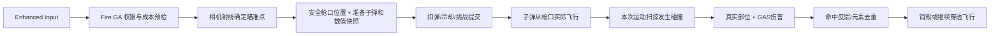

# 实体子弹系统设计

## 状态、目的与范围

2026-09-22：已按确认方案完成第一版实现。开火射线只决定子弹初始方向，真实子弹碰撞敌人后才通过GAS结算伤害；子弹基类和蓝图子类提供Mesh等配置。本文同时作为实现说明；编译、资产创建和回归的实际结果记录在文末，未完成项目不得视作已验证。

第一版覆盖玩家手枪、步枪、散弹枪、狙击枪及普通/火焰/冰冻/穿透弹，采用无重力直线弹道。保留Enhanced Input、GAS开火/装填/瞄准、弹匣/射速、挑战资格、受击部位和经济规则。敌人已有飞行物本轮保持现状，后续可迁入共用基类，避免同时改变敌人攻击手感。

## 当前代码依据

- `Weapons/DemoWeaponBase.cpp::PerformBallistics`目前用相机射线确定AimEnd，再用枪口射线直接命中；散弹同一调用内按敌人聚合GE，穿透还会立即向后查询第二个目标。
- `GAS/DemoGameplayAbility.cpp`中的Fire GA负责武器成本和冷却；`ExecuteCommittedShot`在造成伤害前登记整轮手枪资格。
- `Combat/DemoEnemyHitZones`要求真实骨骼组件、PhysicsAsset刚体、BoneName和通道响应，不允许缺骨时猜测机身伤害。
- `AI/DemoEnemy.cpp`的移动根球忽略WeaponTrace，AnimatedBody只阻挡WeaponTrace；实体子弹不能不改碰撞矩阵就直接接入。
- `GAS/Ammo/DemoAmmoStatus`当前持有Catalog并在后续叠层时读取阈值；`Enemy::OnHealthChanged`每次实际直伤都播放肉体音。异步弹丸需要配置快照和每枪反馈去重。
- 本地UE5.4引擎的ProjectileMovement支持UpdatedComponent连续扫掠。默认阻挡后会停止模拟并清空UpdatedComponent，穿透必须处理运动组件的阻挡决策，不能只在OnHit中重新设置速度。

## 发射与伤害流程



相机从准星向前做一次瞄准查询；命中取碰撞点，未命中取配置射程末端。子弹初始方向为`Normalize(AimPoint - SafeMuzzlePosition)`。散弹按每颗独立散布方向解析瞄准点，仍从同一安全枪口发出。

AimPoint只影响发射方向，不保存“必中的敌人”，不应用GE、不播放肉体命中声，也不把该点作为自动销毁位置。敌人离开原位置，子弹可以打空；另一只敌人进入轨迹，可以挡住子弹。射出后不随准星转向，不自动追踪。

高速扫掠只检查子弹这一帧实际经过的球体路径；它属于实体运动碰撞，不是开火瞬间沿整条射程预结算伤害。普通飞行无碰撞时不执行伤害查询。第一版默认无重力；若后续开放重力，射线只提供初始方向，抛物线命中解算另行设计。

枪口防穿墙使用与子弹半径一致的短程空间检查，仅决定安全生成位置。枪口越过墙时不能在墙后生成；找不到可信安全位置则拒绝发射。贴墙命中也必须由实际子弹碰撞处理，禁止通过防穿墙射线扣血。

## 类与职责

| 建议类型 | 职责 | 所有权与限制 |
|---|---|---|
| `ADemoProjectileBase` | 准备/激活、碰撞入口、有效性、寿命、穿透决策、蓝图表现事件 | World中的独立Actor；不是挂在GameMode上的每帧组件 |
| `UDemoProjectileMovementComponent` | 继承ProjectileMovement，扫掠移动及停止/穿透继续 | 子弹持有；普通碰撞和穿透共用唯一结算入口 |
| `ADemoProjectileTracer` | 显示真实已飞过路径末端的发光短拖迹，停弹后短暂淡出 | World拥有的纯表现Actor；无碰撞、无伤害、无ShotContext，不延长实体弹寿命 |
| `FDemoProjectileConfig` | Mesh、材质、外观偏移、速度、半径、寿命、拖尾与撞墙表现 | 子弹BP的Class Defaults；运行时只读 |
| `FDemoProjectileLaunchData` | 单颗弹丸的初始位置/方向、PelletIndex等 | 发射时值快照，不保存瞄准目标Actor |
| `UDemoShotContext` | 一次扣弹对应的ShotId、RunId/关数、伤害/弹药快照、每目标元素和反馈去重 | 同一枪所有子弹UPROPERTY强引用；不跨World或存档，不依赖原武器仍装备 |
| `DemoProjectileDamage` | 真实Hit校验、部位倍率、独立Health GE提交 | 普通C++辅助逻辑，不再创建伤害子系统或第二份生命值 |
| `FDemoAmmoEffectSnapshot` | 元素持续、周期、阈值、爆炸/减速/冻结参数 | 从Catalog复制的值；长期状态与子弹寿命分离 |

基类使用`Blueprintable`且原生可实例化：旧武器尚未迁移资产时仍能通过原生默认类发射实体子弹，不回退射线伤害。蓝图可配置数据和实现发射/命中/结束的表现事件；扣血、去重、权限和生命周期由C++控制。需要新行为时用受限C++扩展点，例如未来的反弹/追踪，不允许蓝图表现事件再次对同一碰撞施加伤害。

子弹组件：Sphere为根碰撞，StaticMesh为无碰撞外观，ProjectileMovement移动根球，按需挂Niagara拖尾。不启用Mesh物理模拟，不用Mesh包围盒作为伤害范围；缩放外观不能意外放大命中面积。首版StaticMesh满足需求，之后可在基类增加互斥的SkeletalMesh表现模式，无需为四把枪复制运动/伤害逻辑。

不急于增加对象池或全局子弹管理器。World拥有子弹，ShotContext由子弹保活；Flow在离开Combat/Shutdown时调用统一清理入口，当前规模可遍历本World的玩家子弹。性能数据证明创建/销毁成为瓶颈后，再加入池化与激活代数，不能把已销毁对象直接当成可复用对象。

## 蓝图配置与武器分工

武器`FDemoWeaponConfig`新增`ProjectileClass : TSubclassOf<ADemoProjectileBase>`，初始化/装备时验证类可用并建立Cook引用，避免每次射击同步加载。蓝图资源由Unreal Editor创建，不手写uasset。

| 配置位置 | 字段 | 规则 |
|---|---|---|
| 子弹BP | Mesh / MaterialOverrides / VisualTransform | 可替换外形、材质和偏移；局部单位cm，外观无碰撞 |
| 子弹BP | InitialSpeed | 有限正值，cm/s；第一版恒速 |
| 子弹BP | CollisionRadius | 有限正值，cm；建议初始约1cm，不按Mesh缩放改变 |
| 子弹BP | MaxLifeSeconds | 有限正值，秒；兜底清理，检查是否足以覆盖武器射程 |
| 子弹BP | TrailEffect / WallImpactEffect / WallImpactSound | 可空；缺表现不阻止可靠碰撞与伤害，肉体音继续使用敌人资源 |
| 子弹BP | bEnableTracer / TracerMaterial / TracerWidth / TracerLength / TracerFadeSeconds | 默认开启发光拖迹；宽3cm、最长120cm、停弹后0.06秒淡出，完全不扩大碰撞范围 |
| 武器BP | ProjectileClass | 本武器生成的子弹类型 |
| 武器BP | BaseDamage / Range / Falloff / PelletCount / Spread | 保持原武器平衡数据来源，不在子弹再配置另一份基础伤害 |
| 弹药Catalog | 普通/火焰/冰冻/穿透数值 | 仍是唯一弹药数值来源；发射时复制，不靠换子弹BP重写Debuff规则 |

Editor脚本创建`BP_Projectile_Pistol / Rifle / ShotgunPellet / Sniper`四个数据派生类。它们共用基类逻辑，差别主要是速度、外观、拖尾。建议调试起点：手枪18000、步枪30000、散弹16000、狙击60000cm/s；这些是待实测手感值，不是已确认平衡。

手枪/步枪/狙击每次生成一颗。散弹一次扣弹、一次开火声/后坐力，生成N颗实体弹丸。保持全局伤害加成按N分摊，不把升级收益放大N倍。狙击镜/FOV仍由武器组件控制，开火退镜不影响已经射出的子弹。

旧武器蓝图的路径和原生父类名称先保留为兼容入口，原`PerformBallistics`改为准备/激活实体弹，不再执行即时射线伤害；旧`ADemoHitscanWeapon`名称只是迁移兼容，不保留第二套伤害路径。之后若更名，需单独提供CoreRedirect并通过Editor保存验证。

## 碰撞矩阵、部位与穿透

新增明确的`PlayerProjectile`对象通道，避免影响模板Projectile或敌人飞行物。

| 对象 | 对玩家子弹响应 |
|---|---|
| 世界墙体/地面/实体障碍 | Block |
| 敌人移动根球 | Ignore |
| 敌人AnimatedBody的PhysicsAsset | QueryOnly + Block |
| 发射玩家及其武器 | 移动忽略列表排除 |
| 其他玩家子弹、触发器、纯表现组件 | Ignore |

ProjectileMovement开启Sweep；Mesh禁用碰撞。球扫掠返回的真实BoneName/Component/ImpactPoint用于既有手臂、机身、核心倍率。`ResolveHit`应共享骨骼/刚体验证，并区分WeaponTrace瞄准与PlayerProjectile物理移动的合法通道，不能把根球碰撞假装成机身。无骨/未知骨/非法组件拒绝伤害并记录原因。

默认运动组件遇阻会停止；定制`HandleBlockingHit`把真实Hit交给唯一`ResolveImpact`，返回Stop或Continue。OnComponentHit可作观测，但不再次扣血。穿透时先登记并忽略整只已命中敌人，保留速度及本子步剩余时间，从真实接触位置继续扫掠。不得跳移到敌人背后或用第二条射线直接扣后方目标血量。

穿透保留当前最多两个不同敌人、墙体终止的规则；同一敌人的多个骨骼刚体不能重复扣血。无敌/零伤害目标是否允许物理穿透沿用当前几何有效命中规则，元素和肉体反馈仍要求实际扣血。第二敌人必须等子弹实际到达，按自己的骨名计算倍率。

第一目标继续用开火时相机位置到实际碰撞点的距离计算原衰减，避免顺便改变数值来源。穿透第二目标保持首段衰减后的基数×SecondaryDamageRatio，再乘自身部位倍率。子弹最大飞行距离独立累计，默认取武器Range；AimPoint不提前截断穿透。

直线高速薄墙需要Sweep；不能用仅Overlap或不扫掠SetActorLocation。子步是曲线/复杂运动的精度工具，不保证高速移动骨骼的连续相对运动永不漏碰；必须实际测试低帧率、横向冲刺敌人和动画姿态。

## 跨帧结算、GAS与反馈

每颗弹丸实际命中即通过独立`UDemoHealthEffect`结算，不等待整枪全部弹丸到达。这是相对旧“同一枪同一敌人汇总一次GE”的明确变化；总伤害公式保持，但子弹可能在不同帧命中、被敌人移动躲开或遇到不同的实时无敌状态。

ShotId使用本次触发独立GUID，PelletIndex为0..N-1；不能仅依赖每个武器都从0递增的ShotSequence。ShotContext冻结武器ID、每颗基础伤害/升级分摊、衰减、部位数值、弹药类型/参数、源Pawn/ASC弱引用、RunId/关数。换枪、退镜或后续属性变化不改在飞子弹；伤害时重新检查目标当前生命/无敌和战斗有效性。

元素规则：同一ShotContext同一敌人最多接受一次火焰/冰霜命中请求，只有实际正伤害且目标存活才处理；在调用状态组件前登记，防同步回调重入。致死不加新状态，无敌/零伤害不触发。碰撞去重在每颗子弹维护，元素/反馈去重在整枪共享，二者不可混用。

`DemoAmmoStatus::Apply`改为接收元素值快照。持续GE后续需要的参数由状态组件按实际ActiveEffectHandle保存，移除时清理，不长期依赖ShotContext或可变Catalog。建议同类已有整组栈采用首层参数直到栈消失，火/冰分别保存；后续命中继续按这组参数刷新/叠层。需覆盖Added/StackChanged同步回调，不能到Apply返回后才设置首次回调所需参数。

肉体音和受击动画按“ShotId + 敌人”最多一次，以免霰弹同一枪叠放N次。Health GE Context关联ShotContext，Enemy健康变化回调在确认实际扣血后申请首次反馈；Context的SourceObject为弱引用，因此在飞子弹必须UPROPERTY强持有ShotContext。DOT保留原排除规则，非子弹爆炸/其他伤害保留原反馈路径。准星命中反馈同样只在真实正伤害后更新，致命一击可反馈。

伤害提交顺序：验证本弹/World/轮次→登记本次碰撞→施加GE→重新检查自身/目标/阶段→元素/穿透后续。GE可能同步触发死亡、清关和子弹清理，不能在GE之后无条件继续操作Actor。

## 发射提交与生命周期

为防散弹只生成一半却扣整发，建议在GA流程内增加准备/提交两段：先校验和创建全部关闭碰撞、关闭运动的待发射Actor，初始化快照并完成蓝图构造；再提交扣弹/射速和一次挑战登记，最后统一激活飞行/表现。任何准备失败撤销整组，不退回射线伤害。

现Fire GA在Execute前已经提交成本，因此实现时需调整激活顺序并引入单次提交凭据。挑战保存失败要撤销准备弹并恢复该次弹药/射速提交，禁止重复退款；已经记录的非手枪失格不因后续失败反向恢复。开始真实飞行后不因个别弹丸被墙挡住/销毁而退款。开火声、枪口焰和资格仅每枪一次；空弹匣仍走现有再次按射击自动换弹，不生成子弹。

提交凭据必须绑定准备时的武器实例、稳定武器ID、RunId/关号和扣费前状态。待发射Actor完成蓝图构造可能同步触发换枪或阶段切换，因此Commit前再次确认准备武器仍为有效当前装备且轮次未变。ApplyCost、ApplyCooldown、挑战登记与失败回滚全部使用凭据中的同一实例，不能重新查询当前装备；不满足条件则撤销整组，防止出现A枪子弹扣B枪弹药并登记B枪资格。

子弹状态建议Prepared→Flying→ResolvingImpact→Flying（穿透）或Consumed→End。命中、距离耗尽、寿命结束、取消共用幂等结束入口；普通弹先消费再施伤，穿透弹先登记本目标并设重入保护。

| 情况 | 处理 |
|---|---|
| 换枪/开镜退出/普通Fire GA结束 | 已发射弹继续，依赖发射快照 |
| Esc暂停 | World运动暂停，恢复后继续 |
| 玩家死亡、离开Combat、换关、返回大厅或旅行Shutdown | 主动清除玩家弹，碰撞入口再检查RunId/关号防旧回调 |
| 源ASC/Pawn失效、目标死亡 | 拒绝过期伤害，按规则结束/经过失去碰撞的尸体 |
| 最大距离/寿命到期 | 结束，不伪造命中/爆炸/奖励 |
| 武器蓝图配置非法、子弹类无效 | 装备/发射预检失败，日志说明，无即时伤害回退 |

子弹和ShotContext不进入存档。归属/轮次判断从RunFlow只读查询，不重新建立战局状态。第一版沿用单人权威结算；网络预测、回溯判定、射击RPC和表现插值不属于此次实现承诺。

## 文件分类与实现步骤

建议新增：`Source/FPSDemo/Weapons/Projectiles/DemoProjectileBase.*`、`DemoProjectileMovementComponent.*`、`DemoProjectileConfig.h`、`DemoShotContext.*`；纯伤害解析放`Combat/DemoProjectileDamage.*`；元素快照放`GAS/Ammo/`。蓝图放`/Game/Weapons/Projectiles/Blueprints/`，Mesh/Materials/VFX按对应子目录分类。

主要修改：WeaponBase/Config的发射入口，Fire GA提交，Enemy受击碰撞/反馈，EnemyHitZones合法命中校验，AmmoStatus值快照，RunFlow阶段/Shutdown清理，DefaultEngine碰撞配置；更新武器/弹药/分区受击文档和相关测试。奖励、金币、存档格式不改。

建议顺序：先普通单颗子弹闭环和枪口/骨骼碰撞；再接入四枪及两阶段提交；再处理霰弹共享Context、元素/音效去重和真实穿透；最后通过Editor创建BP资源、回归与性能测量。期间全程只保留一条实际伤害路径，防止旧射线与新子弹同时扣血。

所有新函数、接口、生命周期/委托回调保留DEMO_LOG_CALL，高频用DEMO_LOG_TICK；日志携带ShotId/PelletIndex/RunId/关号及拒绝原因。Editor可开瞄准线/实际扫掠轨迹调试；包体调用、逐弹与逐帧日志仍在Display编译上限下裁掉，不把每颗命中提升为Display。字段注释包含单位、范围、所有权和生命周期。

## 验收标准

1. 瞄准命中但子弹未到达时，敌人血量不变；目标移开能打空，途中其他敌人能挡弹。
2. 四枪扣弹/射速/换弹/狙击镜正常；散弹数量、散布和全局加成分摊正确，发射准备失败没有半组子弹或双扣费。
3. 高速薄墙、枪口贴墙/墙内、低帧率和高速横移敌人；子弹不从墙后出生，缺骨不产生伪机身伤害。
4. 手臂/机身/核心倍率与真实骨骼Hit一致；Boss护板遮挡与实时无敌仍有效。
5. 散弹跨帧命中同敌累计伤害，多颗只加一层元素/一次肉体声；不同敌人分别去重，致死不叠状态。
6. 穿透先碰A再飞行碰B，不能瞬间扣B；敌后墙挡住弹，A多刚体不重复受伤，后段独立部位倍率。
7. 飞行中换枪不改伤害/弹药类型；暂停/恢复一致，死亡/清关/旅行同帧旧弹不再扣血或发奖。
8. Fire GA结束不提前销毁子弹；所有弹丸结束后ShotContext可回收，持续元素效果仍使用自己的快照。
9. 更新现有Weapon/Ammo/HitZone等测试，从“开火后立即掉血”改为实际等待命中，设置有界超时；回归手枪挑战、装备持久化、刷怪清场及经济。
10. Editor编译与真实World测试、Development包体和日志边界验证；记录最大同时在飞数量、散弹频率下的帧耗时，再决定是否需要池化。

以上为验收清单；实际执行记录见下节。


## 本轮实现与使用入口

- `Tools/Unreal/create_projectile_assets.py`由Unreal Editor Python执行，创建四个真实子弹BP并为已有武器配置ProjectileClass；重跑保留已配置的自定义子弹类及武器美术/平衡参数。禁止使用脚本直接写uasset字节。
- Editor中打开`/Game/Weapons/Projectiles/Blueprints/`下对应BP，在Class Defaults的Projectile.Config中配置Mesh、材质、速度cm/s、半径cm、寿命秒、外观Transform和可空Niagara/撞墙音；打开武器BP的Weapon.Config选择ProjectileClass。
- 新对象通道为`ECC_GameTraceChannel3 / PlayerProjectile`，由DefaultEngine.ini声明。敌人运行期重新校正旧BP序列化的响应，仍须具备有效PhysicsAsset和骨名白名单。
- `.uproject`显式启用Niagara，Build.cs加入依赖，以支持可空拖尾/撞墙表现；JSON不支持注释，依赖变更原因记录在此。
- Fire GA固定武器实例和激活代数；蓝图构造或GAS提交委托导致取消/再激活时，旧调用栈不能提交新枪。主槽索引0..2通过+1映射目录1..3，副槽手枪为0，修复旧身份偏移影响手枪挑战的风险。
- 测试入口`-DemoProjectileTest`与既有专项一样使用隔离临时进度并禁用云同步；不影响普通游戏流程。既有Ammo/HitZone/Smoke测试已迁移到等待真实弹丸完成的流程。

## 本轮验证记录

已执行并通过以下检查。日志均位于项目`Saved/Logs/`，检查成功标记及失败/Error，而非仅以进程退出判断成功（Editor游戏请求失败退出时，宿主有时仍返回0）。

| 检查 | 日志 | 结果 |
|---|---|---|
| UE5.4 Editor Development全量/增量编译 | ProjectileBuild.log、ProjectileBuildFinal.log | UHT/C++/链接通过；保留旧ResolveHit三参蓝图接口，新通道使用纯C++入口 |
| Editor创建及独立进程重新读取4个BP | ProjectileAssets.log、ProjectileAssetsVerify.log | 四个真实BP与四武器关联已保存；重跑保留配置 |
| 实体弹World专项 | ProjectileRuntime.log | 开火/飞行中无即时扣血、到达伤害、移动躲避、发射后墙体阻挡、换枪快照、真实分时穿透、60000cm/s对2cm薄墙、阶段清理、非法类不扣费、手枪/步枪身份均通过 |
| 15FPS真实RHI运行 | ProjectileLowFPS.log | RenderOffscreen + t.MaxFPS 15，实体弹专项通过 |
| 弹药及首层快照 | ProjectileAmmoVerified.log | 散弹8次实际GE但一次火层；目录修改不改变已有组、火冰独立、阈值1同步消费通过 |
| 真实骨骼分区 | ProjectileHitZonesVerified.log | 机身20/手臂13/核心40、护板开合、穿透后目标独立部位、墙阻通过 |
| 四枪与Enhanced Input回归 | ProjectileWeaponVerified.log | 数字切枪、连发/半自动、空仓再次开火换弹、有限备用、取消装填、散弹伤害、狙击镜通过 |
| 完整玩法与实际音频设备 | ProjectileSmokeAudioVerified.log | 十关、奖励/商店、通关回Hub、死亡/坠落重开通过；开火与真实扣血产生空间音频实例，治疗/零伤害/拒绝射击不误播放，短音效正常结束 |
| Development BuildCookRun | ProjectilePackage.log | Build、Cook、Stage、Pak、Archive全部成功，包含四个子弹BP |
| 实际Development包体飞行 | ProjectilePackagedRuntime.log | 同一实体弹专项成功；记录RequestExitWithStatus(0,0)，无失败/Error |
| 包体日志/调试边界 | ProjectilePackagedBoundary.log | FPSDemo.Debug.BuildBoundary成功，WITH_EDITOR=0，轨迹及全解锁命令均缺席；强制VeryVerbose仍无项目调用/逐帧日志与详细哨兵 |

上述最终运行日志均无失败标记/Error。第一次专项发现并修正测试夹具解锁前提；旧Weapon/Smoke夹具同时更新真实终端范围、手枪资产伤害和每十关Boss规则，不放宽生产权限。旧失败日志不是最终验收结果。

打包产物：`Saved/ProjectilePackagedValidation/Windows/FPSDemo.exe`（启动器）；实际游戏程序位于其`FPSDemo/Binaries/Win64/FPSDemo.exe`。所有玩法专项使用隔离进度并禁云；包体验证额外以`-ini:Game:[/Script/FPSDemoOnline.DemoApiClient]:bEnabled=False`关闭API，边界Automation使用独立测试GUID。

可复现的Editor专项命令：

```powershell
& 'F:/UE5.4.4/UnrealEngine-5.4.4-release/Engine/Binaries/Win64/UnrealEditor-Cmd.exe' 'F:/UE5.4Project/FPSDemo/FPSDemo/FPSDemo.uproject' /Game/Whitebox/Maps/L_ThreeSector_Whitebox -game -nullrhi -unattended -nosound -DemoProjectileTest '-LogCmds=LogFPSDemo Log' '-abslog=F:/UE5.4Project/FPSDemo/FPSDemo/Saved/Logs/ProjectileRuntime.log'
```

将专项参数替换为`-DemoAmmoTest`、`-DemoWeaponTest`或`-DemoEnemyAttackTest -DemoEnemyHitZoneTest`可执行对应回归；同项目Editor进程串行运行，避免共享资产缓存争用。音频验证使用`-DemoSmokeTest -DemoAudioValidation -AudioMixer -RenderOffscreen`，移除`-nullrhi/-nosound`。

Editor控制台`Demo.Debug.ProjectileTrajectories 1`显示真实扫掠段与接触点，`0`关闭；该命令不存在于包体。玩家子弹核心正常日志为Log/VeryVerbose，非Editor保留关键阶段Display和异常Warning/Error。

尚未执行Shipping构建、多人网络预测/回溯、大规模弹丸峰值压测和复杂高速横移动画的专项扫掠误差测量；本轮结果不代表这些能力。当前提供的是单人直线实体弹道及可替换Mesh外观，Niagara表现可留空。高速子弹的可读性修复见下节，独立拖迹不依赖Niagara资产。

## 2026-09-22 高速子弹看不清的修复

### 原因与设计边界

用户运行日志`FPSDemo.log`中已经出现同一ShotId的`PROJECTILE_LAUNCHED → PROJECTILE_DAMAGE → PROJECTILE_CANCEL`，例如步枪30000cm/s，约443cm的命中在7ms内完成。不是只发出了瞄准射线而没有生成实体弹。用户停止验证前已完成的只读资产记录`ProjectileVisualBefore.log`显示：四个子弹BP当前使用`/Game/FPWeapon/Mesh/FirstPersonProjectileMesh`，外观缩放仅0.02，材质覆盖与Niagara拖尾为空；组件Visible为true，HiddenInGame、OnlyOwnerSee与OwnerNoSee均为false。CDO的Actor Hidden=true属于正常准备态，激活时会解除。

小模型、高弹速与命中立即Destroy叠加，使可见窗口很短；同一帧内命中的弹可能完全来不及被画出来。此前15FPS测试确认的是碰撞与伤害流程通过，并未用截图确认玩家能看清默认速度子弹。

修复保留用户选择的Mesh、VisualTransform、弹速和碰撞半径，增加与伤害实体分离的发光拖迹。不能为了拖尾延迟销毁伤害Actor，也不能画从枪口直接到瞄准点的整条射线冒充实际飞行。

### 执行流程与配置

1. 正式激活子弹时创建一个无碰撞`ADemoProjectileTracer`，待准备或扣费失败时不创建。
2. `RecordTravel`只将实际运动后的末端与累计路程交给拖迹。短条沿真实直线弹道朝后延伸，长度受已飞路程和TracerLength共同限制，前端不越过当前球心或墙体接触位置。初始长度为零，不在枪口前方预画尚未飞过的路径。
3. 命中、射程耗尽或寿命结束仍立即停止并销毁实体子弹。独立拖迹不持有伤害上下文，以`TracerOpacity`私有动态材质参数短暂淡出后自行销毁。暂停遵守World时间。
4. `CancelAll`在离开Combat/旅行清理时也立即销毁所有独立拖迹，不能把上一战斗的表现带入安全区或下一关。

在四个`BP_Projectile_*`的Class Defaults → Projectile.Config中调整：

| 字段 | 用途 |
|---|---|
| Enable Tracer | 是否启用独立短拖迹；关闭后仍可自行配置Mesh/Niagara |
| Tracer Material | 推荐`/Game/Weapons/Projectiles/Materials/M_Projectile_Tracer`，Unlit加法混合，不依赖场景灯光 |
| Tracer Width | 拖迹宽度cm，默认3；只控制画面，不参与命中 |
| Tracer Length | 已飞路径末端最多显示的长度cm，默认120，不是武器射程 |
| Tracer Fade Seconds | 默认0.06秒；先保留完成帧及第一个后续游戏帧，再累计World时间淡出，避免低帧率下直接跳过显示；0表示立即清除 |
| Mesh / Visual Transform | 保持自定义子弹实体模型与其比例，修改Mesh尺寸时需同步检查此缩放 |

材质参数`TracerColor`控制线性HDR发光颜色，初始橙黄(12,3,0.2)；`TracerOpacity`必须保留供淡出使用。自定义材质若没有Opacity参数，就只能在生命周期结束时直接消失。不要关闭深度测试，墙壁必须能遮挡拖迹。

运行`Tools/Unreal/create_projectile_assets.py`通过Editor创建材质并补充四个BP的空TracerMaterial引用；已有自定义引用、关闭开关、运动参数和Mesh均保留。该脚本不直接写二进制uasset，CDO硬引用保证Cook收集材质。原生类或自定义BP未配置发光材质时可使用基础外观，但不能保证与正式四枪相同的可读性。

### 失败处理、维护与验证安排

拖迹生成失败不阻止已经提交的子弹飞行和伤害，异常需记录；表现字段仍需有限数值及合法范围校验。所有普通函数与高频入口保持源码日志埋点，逐弹诊断不提升为Display，包体继续按既有编译上限降噪。

影响文件：`Weapons/Projectiles/DemoProjectileBase.*`、`DemoProjectileConfig.*`、新增`DemoProjectileTracer.*`、`Tools/Unreal/create_projectile_assets.py`、四个子弹BP和新材质。本次不修改存档、武器伤害、奖励或敌人碰撞规则。

用户明确要求自行验证，本次不新增或运行可视专项、自动化游戏测试、截图检查和打包回归，仅进行生效必需的Editor编译与资产创建。建议用户在四枪默认弹速下观察近距离命中、远距离飞行、散弹多弹丸、贴墙/墙后遮挡、暂停、清关与死亡清理；表现残留期间不得继续造成伤害。此前测试表属于上一轮实现，不代表本次视觉修复已经通过游戏验证。

交付记录：`Saved/Logs/ProjectileVisibilityBuild.log`及`ProjectileVisibilityBuildFinal.log`记录Editor编译完成；`ProjectileVisibilityAssets.log`记录Editor创建真实材质并将其绑定到四个子弹BP，结束标记`PROJECTILE_ASSETS_SUCCESS`。重新打开项目编辑器即可由用户进行游戏和画面验证。
