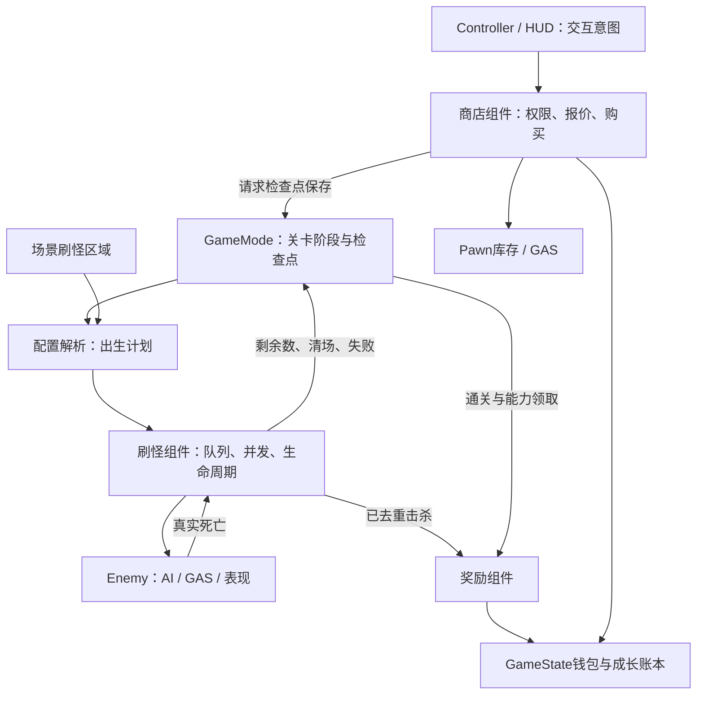
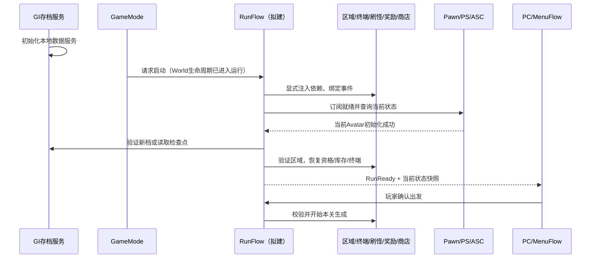
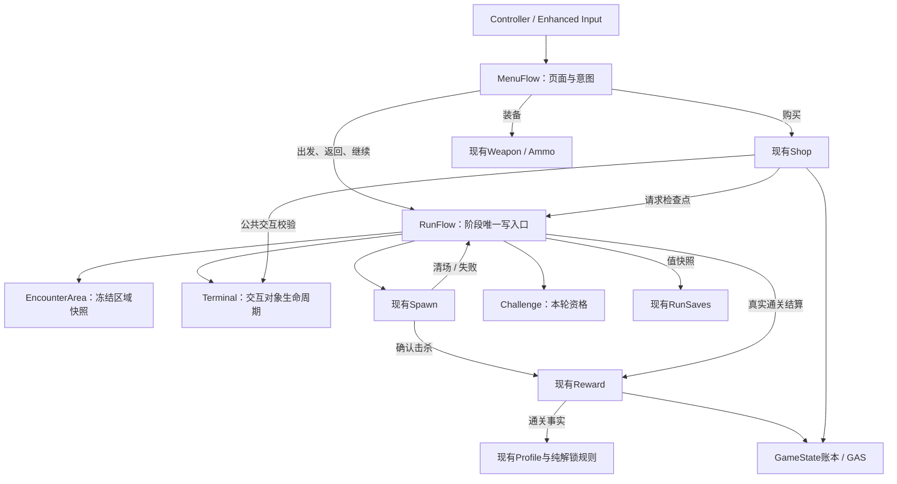

# 系统组件与职责划分

## 目的与设计取舍

把同一生命周期内的相关业务聚合为系统，减少GameMode同时生成怪物、发奖励、处理购买的耦合。保留现有十关/无尽、双币、永久成长、武器解锁与检查点V5语义，既有UI和测试入口用薄适配转发，不增加第二份钱包或库存。

本次实现三个GameMode默认子组件：`UDemoEnemySpawnComponent`、`UDemoRewardComponent`、`UDemoShopComponent`。它们仅存在于权威World，不跨旅行保存Actor或Timer，也不代表完整多人支持。GAS所有权仍保持PlayerState拥有ASC、Pawn作为Avatar。

按归属和生命周期选择机制：由玩法Actor组合的业务使用ActorComponent；独立于具体玩法的世界注册/查询使用WorldSubsystem；跨地图存档/账号/云队列保留GameInstanceSubsystem；纯数据计算使用普通值对象/函数；配置用DataTable或DataAsset；场景位置用Actor。不是每个文件都需要再包装成组件。

## 核心调用链



GameMode不再维护敌人集合、待生成计数和补怪/清关Timer。Enemy不再直接调用GameMode发钱：GAS归零只广播`OnDefeated`，刷怪组件移除成功才发`OnEnemyDefeated`，奖励组件订阅该事件。组件清场事件延迟到下一帧，只发一次，避免在GAS属性委托栈里切阶段。GameState的`EnemiesRemaining`仍是HUD的只读统计来源。

## 刷怪系统与配置

- `Spawning/DemoSpawnPlan.*`：解析已验证的关卡/难度/怪物行，生成本关数值快照。不为无尽百万上限预分配每只怪的数组，而是保存兵种模板和数量预算。
- `Game/DemoEncounterRules.*`：保留每5关三兵种、每10关额外Boss；RunId、关号、小怪序号确定随机袋，碰撞重试不重抽类型。
- `Spawning/DemoEnemySpawnComponent.*`：普通与无尽共用执行器，成功创建才消费队列，所有阶段都使用有界候选和失败处理。Boss优先，不占小怪名额，三兵种完整袋保证共存。
- `Spawning/DemoEnemySpawnArea.*`：可从Place Actors拖入场景或创建派生蓝图。设置`ArenaIndex=0..2`，Actor位置/旋转为出生区域原点；每区最多一个，重复明确拒绝。运行前冻结几何，不保留区域Actor裸引用。

在GameMode蓝图的`SpawnSystem → Settings`编辑配置：

| 字段 | 默认/范围 | 作用 |
|---|---|---|
| Interval | 0.5秒 / 0.05..10 | 补充和阻挡重试间隔，暂停随World停止 |
| BatchLimit | 32 / 4..64 | 一次回调最多生成数；默认普通关最多31只可一次完成 |
| CandidateAttempts | 24 / 1..64 | 每只本次尝试的最大候选点数 |
| BlockedPassLimit | 60 / 1..600 | 连续找不到位置的次数上限，成功生成一只后重置 |
| MinPlayerDistance | 450cm / 0..5000 | XY安全距离，生成前后都校验 |
| MinionRows | 空 | 可为Melee/Charger/Ranged指定专属DT_Enemies行；空则沿用Level.EnemyRow |
| MinionClasses | 空 | 可按兵种覆盖ADemoEnemy派生蓝图；不允许空值/抽象类/其他兵种键 |
| BossClass | 空 | 可覆盖Boss蓝图；空使用原生ADemoEnemy |

并发上限：普通关使用本关总数量，无尽使用`DT_Endless.MaxAlive`（4..16）。总数量、生命、伤害、掉落成长仍来自现有表。设置与计划开关时复制，战斗中热改不会让同一波前后使用不同配置。

区域`Geometry`提供普通椭圆半径/中心偏移、无尽外圈半径/高度、Boss专用出生点。Boss专用点堵塞后也有外围候选。Actor缩放不参与计算，调整半径字段即可；参考框仅用于编辑器识别，不是阻挡体。未放区域时自动采用原白模中心与默认几何，不需要重新生成地图资产。区域应放在对应战斗场地内；本系统不修改玩家入场、终端位置或NavMesh，完整地图布局仍由现有区域逻辑负责。

明确行为变化：普通关由“单点阻挡立即失败”改为和无尽一致的候选/重试流程；Boss优先生成并使用可配置专用点。生成使用最终Boss半径预检碰撞，不强制穿墙。计数、数值、兵种节奏和清关奖励保持原规则。

## 奖励系统

`Economy/DemoRewardComponent.*`处理三种收益：

1. `HandleEnemyDefeated`仅订阅刷怪器确认事件，按实例冻结银币发放并增加击杀数；钱包饱和上限沿用存档约束。
2. `GrantVictory`只接受普通战役第十关真实清场，按难度`VictoryGoldReward`发金币，同RunId防重；GameMode随后进入Victory，再调用`RecordVictoryUnlocks`提交Profile通关事实，保留Profile对真实Victory阶段的校验。
3. `GrantAbilityChoice`校验Reward阶段、0..2选择和本World的RunId/关号领取标记，再调用现有角色/GAS奖励接口。GameMode转Intermission并保存，读档后依据检查点阶段阻止重复领取。

金币永久成长、银币临时成长清理及死亡重开仍由会话规则协调；武器/地狱/无尽解锁仍由Profile保存。奖励组件不另存持久账本。通关检查点恢复不会重新调用发金币入口；Profile幂等通关补记仍由既有续玩流程完成。存盘失败沿用现有保存状态UI和重试规则，不宣称支持任意崩溃点的服务器事务。

## 商店系统

`Economy/DemoShopComponent.*`集中终端权限、属性价格/购买、弹药权限与报价购买。原`GameMode.PurchaseUpgrade/GetUpgradeCost/GetPurchaseBlockReason/GetTerminalBlockReason`和`AmmoComponent.Purchase/GetBlockReason`仅作兼容转发。

购买前重新校验权威、阶段、玩家生命、页面、模态、暂停、250cm终端距离、余额及数值上限。金币/银币由当前阶段决定，UI不能传币种。属性独立价格与永久/临时来源账本保持原规则。同步事务设重入门控，GAS回调不能递归购买。

弹药价格在确认时重验，已解锁或过期报价拒绝；金币和解锁在同一检查点保存，失败同步回滚，装配不自动发生。弹药库存唯一属于Pawn组件，Shop通过受限friend访问提交/撤销解锁；装备GE、恢复和战斗效果仍由库存/GAS负责。

属性购买保持既有策略：GE成功后扣币、更新对应价格并补生命/弹药，自动保存；磁盘失败保留内存交易和保存失败状态，后续检查点重试，不返回虚假的“未生效”。它目前不同于弹药购买的失败回滚策略；如将来统一为持久化事务，需要同时对GAS、生命/弹药补给和成长账本建立完整撤销快照，不能仅退币而留下属性。

当前武器是通关解锁后免费装备，没有金币购买武器交易，因此不新增扣币规则。武器页共享Shop终端权限，实际库存生成、弹药保留、动画链接及装备提交继续由`UDemoWeaponComponent`负责。

## 架构审查与后续拆分方案（2026-09-22）

状态说明：上文刷怪、奖励、商店三个组件已经实现；本节的新增组件、接口和目录是下一阶段设计，尚未迁移。此次实际代码变更是困难通关补解锁散弹枪，见[武器库与玩家存档](武器库与玩家存档.md)。采用渐进迁移，每一批均能单独编译、运行和回退。

### 挂载选型复核：按职责选择宿主

2026-09-22复核结论：GameMode是当前单人Demo中权威战局规则的合适宿主，但不能据此把所有World服务统一挂上去。上一版统一挂载的建议收窄为：RunFlow、Spawn、Reward、Shop、Terminal以及本轮Challenge由GameMode组合；区域发现/锚点查询改为`UDemoEncounterAreaSubsystem : UWorldSubsystem`。这是方案修订，当前三个已实现组件没有搬迁。

选择顺序是“数据/业务属于谁→需要活多久→谁能执行、谁需要读取→是否需要Actor/复制/蓝图配置”。GameMode拥有组件并不等于组件必须强依赖`AFPSDemoGameMode`具体类；当前Shop仍调用GM取终端/存档，Reward仍按同Owner查Spawn，后续应改为注入Terminal、刷怪事件和保存请求接口。单纯把这些GetAuthGameMode调用换成GetSubsystem不会消除业务耦合。

| 候选宿主 | 适合的职责 | 本项目决策与限制 |
|---|---|---|
| GameMode + ActorComponent | 当前玩法的权威规则、可选功能组合、战局流程协调 | 保留当前Spawn/Reward/Shop，后续加RunFlow/Terminal/Challenge。这些业务随玩法启停，不应因自动创建Subsystem就开始运行 |
| GameState + Component | 双端可见的战局状态、确有双端生命周期需要的共享体验组件 | 当前继续承载阶段/关号/剩余数等状态。无需为了UI读取而把整个交易/刷怪执行器迁过来；挂在GS也不意味着任意字段自动复制 |
| WorldSubsystem | 不依附具体GameMode的世界注册、区域/锚点查询等服务 | EncounterArea使用此形式，可服务未来不同玩法；按World隔离，只支持Game/PIE，不承担金币、阶段或保存职责 |
| 场景Actor及其组件 | 有位置、碰撞、交互表现或设计师需在地图配置的对象 | SpawnArea/终端Actor继续存在；不以无位置Subsystem取代场景实体。未来多个独立遭遇同时运行时，可引入每个遭遇自己的Director Actor与Spawn组件 |
| PlayerState / Pawn / 本地PC | 玩家身份进度 / Avatar行为 / 本地输入页面 | 维持ASC在PS、武器在Pawn、MenuFlow在PC。当前单人钱包与挑战状态不为假设中的联机立即搬家；若增加多玩家，个人钱包/资格需单独设计PS归属 |
| GameInstanceSubsystem / 普通值函数 | 跨地图持久数据服务 / 无状态计算 | 继续用于存档云同步 / 检查点字段转换，均不持有旧World Actor |

挂载GameMode不会要求它逐项代办所有业务；GM作为组合入口创建服务，RunFlow只编排用例，Spawn/Reward/Shop各自处理内部业务。当前一个World只有一个活动战局，把生成执行器直接改成全局WorldSubsystem收益有限，还会增加预览World、非战斗地图和客户端启停边界。因此当前保留其组件形态，而非为统一形式批量迁移。

本地Lyra参考证据：`F:/Lyra/Lyra/Source/LyraGame/GameModes/LyraGameState.cpp`在GS创建ExperienceManager；`Player/LyraPlayerSpawningManagerComponent.h`继承GameStateComponent，GM委托它处理玩家出生；`AbilitySystem/Phases/LyraGamePhaseSubsystem.h`使用WorldSubsystem。`LyraExperienceManagerComponent.cpp`的CallOrRegister_OnExperienceLoaded在已就绪时立即执行，否则登记通知。借鉴职责分层与这一就绪契约，不引入Lyra的Experience/GameFeature插件依赖，也不把它的玩家出生管理直接等同于本项目敌人刷怪器。

| 功能 | 当前归属 | 建议及原因 |
|---|---|---|
| 刷怪、奖励、商店交易 | 本次三个World组件 | 已实施；频繁扩展且生命周期清晰，GameMode只协调 |
| 终端生成/清理、场景区域与玩家入场 | GameMode | 第一批提取EncounterArea世界子系统与Terminal组件；前者提供位置快照，后者按战局阶段管理交互对象 |
| 会话旅行、通关/死亡重置、检查点恢复 | GameMode + DemoSessionFlow | 第二批提取RunFlow组件，成为唯一阶段写入者；检查点组装用值转换器，不再建立第二个存档服务 |
| 暂停/存档/设置/终端页面 | PlayerController + Canvas HUD | 后续提取MenuFlow组件；Controller保留Enhanced Input，HUD绘制和命令入口保持兼容，不要求同时重写UMG |
| 整轮手枪资格、地狱/无尽条件 | GameMode开火登记 + Profile事实 | 第三批提取Challenge组件管理本轮资格；Profile继续独占永久事实，解锁计算为纯规则 |
| 钱包、价格与成长来源 | GameState + DemoUpgradeProgress | 保持单一账本；规模扩大后提取值模型，暂无必要再建第二个钱包组件复制余额 |
| 武器库存/切换、弹药选择、动画协调 | 现有Pawn组件 | 保留；与Avatar生命周期一致，枪械实例保存独立弹药 |
| 敌人导航、战术、近战、表现 | 现有Enemy组件 | 保留；刷怪器只配置实例，不接管敌人行为 |
| 技能、伤害、属性、Debuff | GAS/ASC/AttributeSet/GE | 保留；不再另造技能或伤害管理器 |
| 玩家档案、检查点、云同步 | GameInstanceSubsystem | 保留跨World生命周期；Editor仅本地临时存档，禁止引入编辑器联网开关 |
| 难度、无尽成长、兵种随机、价格公式 | 配置和值函数 | 保持纯计算，便于复现与测试，不需Tick或全局单例 |
| 武器空间音频调用 | Audio命名空间函数 + Sound资产 | 当前无独立生命周期状态，保持函数服务；有明确音频预算/池化需求时再考虑World服务 |

不要将这些职责全部塞进一个“全局管理器”。组件间使用有类型事件和小接口；持久状态通过稳定ID和值快照传递，不保存Actor/组件指针。当前仍为单人Standalone/PIE权威执行；多人需要额外设计RPC、复制和预测，不能靠组件化自动获得。

### 数据归属与生命周期

| 数据 | 唯一所有者 | 其他系统如何使用 |
|---|---|---|
| 阶段、关号、模式、难度、RunId的推进权限 | 拟建RunFlow；GameState保留唯一可见状态字段 | 其他组件请求动作；不得自行把Combat改为Victory。GameMode旧接口只转发 |
| 当前刷怪计划、待生成队列、存活集合、生成Timer | 现有Spawn组件 | 发布统计与有类型的成功/失败事件，外部不改计数 |
| 场景锚点、区域就绪状态 | 拟建EncounterArea | 提供只读值快照；战斗期间使用冻结几何 |
| 当前升级/出发终端、交互会话有效期 | 拟建Terminal | World拥有Actor，交互者仅持弱引用与版本号 |
| 金银币、六项购买等级、永久成长来源 | 现有GameState与DemoUpgradeProgress | Reward/Shop通过受控写入口更新；不另建余额副本 |
| 当前轮手枪资格及本轮挑战状态 | 拟建Challenge；GameState是只读展示投影 | 通过RunId匹配事件；检查点保存值，不保存组件引用 |
| 永久通关事实、武器/模式解锁与偏好 | 现有PlayerProfile子系统 | 真实事实派生权限；RunFlow/Reward只能提交已校验的通关 |
| 本槽检查点、装备快照、耐久待上传数据 | 现有RunSaves/Profile/CloudSync，各管原有文件 | World协调器请求保存和读取结果，不能直接HTTP或操作MongoDB |
| 武器Actor、弹药/开镜/装填；ASC属性/技能/GE | 现有Pawn武器组件；PlayerState ASC | 世界系统只调用语义接口，重生重新绑定Avatar |
| 菜单层级、待确认选择、输入阻塞原因 | 拟建MenuFlow，Owner为本地PlayerController | HUD只读视图；Controller根据视图应用输入、光标及暂停 |

挂在GameMode上的组件随Owner销毁，EncounterArea子系统随World结束清理；二者的释放顺序不构成业务保证。终端、敌人、Avatar引用不得跨旅行保留。GameInstance子系统保留原有跨World职责。设备设置继续使用GameUserSettings，与存档槽和账号成长无关。Editor停止试玩清理临时档案的规则不变，任何新组件都不能创建Editor云同步例外。

### 挂载位置、创建时机与加载时机

组件创建、资源加载和业务启动是三个不同步骤。构造函数只创建默认子对象和设置默认值；构造CDO、打开蓝图或编辑属性时也可能调用构造函数，因此此时不查玩家、不读存档、不绑定World Timer、不开始刷怪。以下新组件仍为设计，现有实现单独标明。

| 系统 | 挂在哪里 | 创建/加载 | 何时开始工作、何时结束 |
|---|---|---|---|
| Spawn / Reward / Shop（已有） | `AFPSDemoGameMode`默认子组件 | 构造中`CreateDefaultSubobject`，随权威World注册 | 当前Reward在BeginPlay订阅Spawn；Spawn仅StartEncounter后生成，Shop按请求执行。旅行/EndPlay撤销Timer与订阅 |
| EncounterArea（拟建） | `UWorldSubsystem`，不挂GameMode | 随受支持的Game/PIE World自动创建；Initialize只准备索引，地图锚点注册/显式解析后才可用 | RunFlow进入存档时请求区域快照；配置、碰撞及所需导航就绪才成功，Deinitialize清理索引 |
| Terminal（拟建） | 同一GameMode默认子组件 | 服务随GM创建，终端Actor按阶段生成 | 新局Hub/读档对应备战阶段/清关时创建；Combat、失败和旅行前撤销。不是每帧寻找全场Actor |
| RunFlow（拟建） | 同一GameMode默认子组件 | 随GM创建，GM在StartPlay安排显式启动协调 | 依赖绑定后可服务大厅；Avatar/存档/区域就绪后才能启动或恢复一局；退出先进入Stopping |
| Challenge（拟建） | 同一GameMode默认子组件 | 随GM创建，不立即开始新挑战 | RunFlow提供RunId后BeginRun或RestoreProgress；仅新轮重置，跨World读档恢复资格 |
| MenuFlow（拟建） | `ADemoPlayerController`默认子组件 | 随PC创建，仅本地控制器启用 | 本地输入可用后绑定UI与状态通知；晚创建读取当前视图，PC结束时解绑 |
| CheckpointAssembler（拟建） | 不挂Actor，不建Subsystem | 普通值转换工具，无独立加载过程 | 保存/恢复调用期间使用，返回纯值，不保存World/Actor指针 |
| PlayerProfile / RunSaves / CloudSync（已有） | GameInstanceSubsystem，非手工挂载 | 每次GI初始化创建；前两者读取本次会话档案 | 跨地图保留；GI结束清理。CloudSync仅非Editor允许，InitializeDependency明确依赖Profile/RunSaves/Api |
| 武器/弹药/动画（已有） | 玩家Pawn默认子组件 | 随Pawn创建，初始化依赖有效Avatar和资源 | Avatar初始化及读档后准备装备；死亡重建后重新恢复，不延长旧Pawn寿命 |
| ASC / AttributeSet（已有） | PlayerState拥有，Pawn为Avatar | PS创建；PossessedBy/OnRep_PlayerState触发角色初始化 | 先InitAbilityActorInfo，再启动能力、初始武器/属性恢复；Avatar切换精确解绑 |
| 区域锚点（已有SpawnArea，拟扩展） | 放在关卡中的Actor或派生蓝图 | 随地图/对应流送区域加载 | EncounterArea注册并验证区号后提供快照；锚点不是GI单例 |

GameMode只存在于权威World。当前单人Standalone/PIE中玩家与这些系统在同一进程；将来联机时客户端不能直接查GameMode，要另行设计Controller请求和GameState复制，不能把组件挂载方案直接当作网络接口。

WorldSubsystem同样不提供自动复制或权威保护。EncounterArea在ShouldCreateSubsystem/DoesSupportWorldType阶段过滤Editor预览等World，但不能依赖此时GameMode已存在；玩法启用由后续RunFlow请求和运行时权限检查决定。若未来客户端也创建区域索引，其查询仅供展示；场景生成、玩家传送和开关仍由权威侧执行。区域配置继续放关卡Actor或配置资产，不依赖可替换的Subsystem蓝图CDO。

资源加载沿用现有路径：四张配置表在GameMode.StartPlay中同步加载并强引用，武器及输入资源沿现有初始化入口加载；本次方案不暗中改成异步。目录扫描、CDO创建或拥有组件都不表示资源就绪。未来改异步时，资产句柄完成且数据验证通过后才能置ConfigReady；缺包、空行、无效类返回失败，图标等纯展示资源可使用占位，不阻塞战斗。加载资产不等于生成该类Actor：终端按阶段创建，敌人只由Spawn按计划生成。

### 启动顺序与时序保障

源码核查基线：当前GameMode.StartPlay先绑定Spawn的剩余/清场/失败事件并同步加载表，再调用Super::StartPlay，然后处理大厅/恢复请求。UE5.4源码`AGameModeBase::StartPlay → AGameStateBase::HandleBeginPlay → WorldSettings.NotifyBeginPlay`分发生命周期；`AActor::BeginPlay`再遍历组件。不能把当前观察到的Actor/组件遍历顺序当成系统依赖契约。当前Reward在BeginPlay绑定，Spawn不会在自身BeginPlay自动开怪，这个前提迁移时必须保留。

拟采用显式的“构造→绑定依赖→等待就绪→运行→停止”协议。内部就绪状态与存档的Lobby/Combat等玩法阶段分开；不能为了通过初始化而提前把玩法阶段改成Combat。

1. **GI层准备数据服务。** Profile和RunSaves完成本地读取或返回明确失败。CloudSync通过InitializeDependency取得服务，但HTTP完成不作为开局前提，离线照常工作；网络晚到数据沿现有大厅冲突流程处理，不能覆盖进行中的战斗。
2. **World层创建对象。** EncounterArea世界子系统、GM/GS/PC/PS/Pawn及各默认子组件建立；不把子系统Initialize完成当作地图Actor已就绪。BeginPlay只做自身准备和注册，不互相假设对方已经完成。GM在StartPlay的Super返回后启动统一协调；玩家若稍后到达，由登录/Avatar就绪事件继续推进。
3. **统一注入依赖并安装订阅。** RunFlow取得同World的GS、EncounterArea子系统、GI服务和组件引用，先绑定Spawn统计/清场/失败及Reward击杀处理，再准许StartEncounter；给Shop注入Terminal校验和检查点请求接口。依赖有向，所有World级服务来自同一World但不强求相同Owner；不可用返回明确原因。禁止Reward、Shop和Spawn各自寻找并启动彼此。
4. **分层判断就绪。** 大厅可先显示；开始/读档要求本地数据有效、表验证通过、区域可用，以及当前Pawn的PS/ASC/初始武器准备完成。导航需要异步构建时等待对应区域可用或明确失败。先订阅就绪事件，再立即查询当前状态，避免先到达的通知丢失；TryCompleteStartup重复调用只提交一次。
5. **恢复或新建。** 新档建立RunId和初始挑战状态；旧档先验证快照，再恢复资格、属性和本槽库存，最后建立匹配阶段的终端。恢复失败不发布RunReady，不保存半成品。全部成功后才允许技能/交互，并给UI一次完整状态快照。
6. **明确出发。** 玩家确认后再次校验终端、依赖及阶段，关闭交互，RunFlow设置战斗上下文，再调用Spawn.StartEncounter。所有消费生成事件的订阅必须已安装；同轮重复出发拒绝。

推荐引入幂等`InitializeServices/BindAvatar/TryCompleteStartup/Shutdown`契约，并维护当前World有效的启动版本。就绪位按实际依赖设置：ConfigReady、SaveReady、AreaReady、AvatarReady、ServicesBound；UIReady只影响显示/本地输入，不阻塞权威世界结算，也不要求等待云同步。Pawn替换立即撤销AvatarReady，用新Pawn重新绑定；存档版本受保护与可重试的暂未就绪应区分，不能一直空等。



图中表示业务依赖顺序，不保证Pawn事件晚于GM请求；“订阅后查询当前状态”正是为了兼容相反到达顺序。不得用固定Delay 0.2秒/等若干帧作为就绪判断。使用事件推进及有界超时；超时记录尚未就绪的依赖，保留大厅/错误页供重试，不逐帧写Warning。

停止顺序由协调器显式发起：先设Stopping并使当前操作版本失效→锁住新出发/购买/恢复→取消Spawn Timer和下一帧清场→撤销终端与交互会话→解绑World和Avatar委托→交回Actor生命周期→旅行。EndPlay重复调用Shutdown必须安全，不能依赖组件析构顺序；GI保存服务继续存活但不能持有旧World强引用。死亡属性回调中的旧Enemy/Pawn按现有延后清理规则处理，避免同步销毁正在广播的ASC。

EncounterArea的Deinitialize应独立清理注册表，组件Shutdown不假定子系统仍存活，双方通过可验证引用/句柄精确解除注册。流送区域晚加载通过锚点注册推进AreaReady，卸载使相关锚点失效；纯查询接口返回Unavailable而非沿用销毁Actor的地址。改成WorldSubsystem只是调整世界服务的归属，不能替代前述就绪和取消协议。

待验证的时序用例：将Avatar就绪安排在协调前/后两种顺序；订阅前已发生就绪；重复Possess和重复恢复请求；缺表/缺武器资源；终端生成失败；最后击杀与死亡/旅行同帧；异步资源/云回执在旅行后返回；暂停中退出保存超时。跨帧回调使用弱UObject和操作版本，资格/清关/交易按RunId与关号去重；所有UObject玩法读写在游戏线程提交，不能用跨线程锁代替正确的生命周期设计。以上为后续实施验收要求，本次只核查现有代码并补充设计，未声称这些新增启动契约已实现或测试通过。

### 日志策略：完整埋点，包体控制输出

现有`Debug/DemoLog.h`与`FPSDemoOnline/Public/DemoApiClient.h`已经按WITH_EDITOR设置项目类别编译上限：Editor保留All且默认VeryVerbose；非Editor Development/Test/Shipping均为Display，编译裁掉Log/Verbose/VeryVerbose以及参数求值。源码继续保留每个函数/接口/回调的调用埋点，不能为了满足埋点要求把这些日志提升成Display。现有Shipping Target启用关键日志并使用独立构建环境；本次未重做Shipping构建。

| 信息 | 编辑器级别 | 包体行为与频率 |
|---|---|---|
| 函数调用、初始化逐步追踪 | Log；高频查询为VeryVerbose | 编译裁掉；不输出Tick/每发子弹/每只怪物的调用链 |
| 正常启动就绪、关卡/阶段切换、实际购买/通关结果、保存状态改变 | Display，按已提交的业务结果记录 | 保留，一次成功操作或状态改变一条，不在HUD轮询里重复输出 |
| 暂未就绪、价格查询不满足条件、可预期的旧请求拒绝 | Log/VeryVerbose | 正常等待不升为Warning；最终操作失败由对应结果日志说明 |
| 恢复失败、保存失败、无效配置等需要诊断的故障 | Warning/Error | 保留；拟对同一操作同一原因去重，重试过程汇总次数，恢复或最终失败另记结果 |

重复故障汇总是新组件和迁移代码的实施要求，不代表当前全项目Warning均已加去重。现有Spawn阻挡重试仍逐次记录Warning；迁移时应同步审查此类路径，在保留Editor逐次细节的同时将包体改为首次/恢复/最终失败摘要。启动关键结果带World/操作标识、RunId和缺失依赖；失败不打印认证令牌、HTTP正文或MongoDB URI。

项目类别降噪不会自动控制UE引擎或第三方插件类别，也不是日志文件大小上限。日志分级的现有验证入口为`FPSDemo.Debug.BuildBoundary`，历史Editor/Development包体结果见[调试与验证](调试与验证.md)；后续每批迁移需复验包体无详细调用哨兵，运行等待/阻挡/保存失败场景确认不会连续刷屏。

### 组件接口和迁移来源

以下接口名为拟议契约。命令返回类型化结果（成功/拒绝码/提示/保存状态），查询返回只读值；同步调用不持有参数裸指针。异步或延后事件必须携带RunId和当前操作版本，旧World或旧轮次的回调直接拒绝。

**1. UDemoEncounterAreaSubsystem：区域注册与空间查询。** 继承UWorldSubsystem，无Tick，不持有具体GameMode引用。迁移`BuildAreas/GetAreaCenter`中的场景解析与显式请求的白模回退；`PlacePlayerInHub`仅将坐标解析提到此处，停止移动、实际传送与生命弹药补给仍由RunFlow调用Pawn接口决定时机。区域快照包含Hub或ArenaIndex、玩家出生Transform、两个终端Transform、敌人出生Transform/Geometry。接口为`RegisterArea/UnregisterArea`、`PrepareAreas`、`ResolveArea`和`ResolvePlayerStart`；尚未注册/无效配置返回明确结果，不在未知坐标强行开始。PrepareAreas按显式战局配置启用回退生成，不因子系统在大厅创建就自动搭场景。

优先扩展现有`ADemoEnemySpawnArea`的区域配置，统一提供敌人/玩家/终端锚点，避免建立另一组互相竞争的坐标Actor。旧白模标签和固定坐标作为显式兼容适配；未放新锚点可回退，重复区号/无效几何必须报错。地图原有网格不归组件销毁，仅清理组件自己生成的回退几何。进入一关时冻结快照，同时交给Spawn和Terminal，场景热改不影响已开始的战斗。

**2. UDemoTerminalComponent：终端与交互有效性。** Owner为GameMode，无Tick。迁移`SpawnTerminals/ClearTerminals/GetShopTerminal/GetNextLevelTerminal`；负责成对创建、失败回滚、阶段切换销毁，以及玩家/终端/距离的公共校验。拟议接口`CreateTerminals(AreaSnapshot)`、`ClearTerminals`、`ValidateInteraction(Player,TerminalId,Generation)`。终端实例版本每次重建递增，旧窗口即使玩家站在新终端旁也不能提交旧对象的交易。

Terminal只输出“交互对象有效”的结果。Shop继续校验商品、币种、余额和价格并执行购买；RunFlow继续校验出发阶段、难度解锁和存档；MenuFlow管理可见页面与弹窗。为避免循环依赖，三者借用Terminal公共校验，不让Terminal再调用Shop查权限。第一批保留Controller查询适配，后续替换成只读交互上下文；UI传来的终端ID/页签从来不单独构成授权。暂停/死亡/越距/旅行时关闭交互并撤销待确认报价。

**3. UDemoRunFlowComponent：唯一玩法流程协调器。** Owner为GameMode，无常规Tick。迁移`StartRun/StartNextLevel/FinishLevel/ChooseReward/SetPhase/FailRun/ContinueAfterVictory/ReturnToSafeHub/TravelToRun`和`DemoSessionFlow`中的恢复编排。GameMode保留引擎生命周期与兼容入口，将StartPlay、登录及退出转交组件。协调器拥有RunId和操作门控，GameState继续提供既有HUD读取字段；生产代码中只有它能写阶段、关号和难度。

主要命令为`StartNewRun`、`RestoreCheckpoint`、`RequestNextLevel`、`RequestReturnHub`、`HandlePlayerDeath`和`RequestTravel`。保持现有Lobby/Hub/Combat/Reward/Intermission/Victory/Defeat枚举；“恢复中/旅行中”先作为内部操作门控，不为拆分随意增加存档阶段。依次预检配置、区域、玩家与存档条件，再取消旧刷怪、撤销终端、安排入场和生成；失败走类型化失败结果，不能把半完成状态存成合法检查点。

检查点采集/恢复字段映射提为普通`FDemoCheckpointAssembler`值转换器，复用`UDemoRunSave::Validate`与`UDemoRunSaves`落盘；它不持有World、不启动线程、不读写文件。恢复先完整验证纯数据与依赖，再重建Avatar、应用永久/临时成长、恢复实际库存、重建阶段对应终端。中途失败清理本次创建物并留大厅，不保存半恢复数据。死亡/放弃的重置快照保存失败时禁止旅行并提供重试；战斗保存仍只维护进入战斗前检查点与挑战资格，不保存半场敌人或半场收益。

**4. UDemoChallengeComponent + 纯解锁规则：本轮资格与永久权限。** Challenge由GameMode拥有，仅记录当前RunId的资格；迁移`RegisterWeaponShot`以及新轮重置/检查点恢复资格。接口建议`BeginRun`、`RestoreProgress`、`TryCommitWeaponShot`、`BuildCompletionClaim`。一次成功武器开火记一次，散弹每颗弹丸和持续伤害回调不重复计数；空弹匣触发换弹不算开火，冲刺/治疗不影响手枪资格。资格改变先保存，失败拒绝此次开火，不能因重进检查点恢复已经失去的资格。

`BuildCompletionClaim`必须经RunFlow确认十关真实清场后使用；它只生成值凭据，Profile负责RunId去重和持久化，Reward负责金币，三者不能相互替代。武器权限由本地`DemoWeaponCatalog::AppendUnlocksForClear`和服务端`WeaponUnlockRules.Resolve`依通关事实计算：普通解锁散弹，困难/困难手枪/地狱解锁散弹与狙击；步枪沿用简单通关；地狱和无尽仍按各自真实条件解锁。不给较低难度补造事实或再次发金币。

当前四把枪和两种挑战可继续使用小型纯规则。若以后配置很多成就，可提取Progression规则文件和带版本的稳定ID配置；服务器同步校验同一规则版本。只改UE DataTable而不更新后端会产生权限冲突，因此暂不把永久解锁随意做成本地蓝图可修改的条件表。旧档只需重算权限，不改SchemaVersion、HTTP协议或历史记录。

**5. UDemoMenuFlowComponent：页面状态与输入策略。** Owner为本地PlayerController，随Controller结束解绑；从`DemoPlayerController/DemoSessionMenus/DemoExitMenu/DemoAmmoMenu`迁移菜单状态，不同时重写Canvas绘制。接口建议`PushPage/PopPage/GetViewState/HandlePhaseChanged/BeginQuit/CancelQuit`；对外发布`OnMenuStateChanged`，Controller仍安装Enhanced Input、绑定按键并应用InputMode/光标/暂停，保证只有一处实际修改输入策略。

状态模型区分底层Gameplay页面、终端或奖励页、最上层模态。Esc覆盖奖励后退出暂停必须恢复原奖励，不能跳过领奖；退出保存页取消后，晚到云回执只能更新保存状态，不能再次退出进程。设置15秒确认和退出30秒等待使用真实时间，暂停World不能冻住倒计时；仅有活动倒计时时请求更新，常态事件驱动。世界授权检查继续在Shop/RunFlow/Terminal，UI禁用按钮只是反馈。

### 主要运行链与失败边界



出发：UI发意图→权威重验终端/阶段/解锁→解析配置和区域→关闭终端交互→切Combat并提交冻结生成计划。清场：Spawn在下一帧确认真实完成→RunFlow校验当前RunId/关号→前九关/无尽进入Reward，选择后存Intermission；战役第十关由Reward按难度发一次金币→切Victory→记录通关→保存结算，再按既有规则回Hub。

死亡/主动放弃：停止生成与交互→采集本槽真实主武器及槽位→用永久成长生成Hub快照，清银币/临时成长→本地保存成功后旅行→新World恢复。通关回Hub同样保留金币、金币成长、各项金币价格、武器与弹药权限及配装；不能用账号最近武器偏好代替本槽库存。

购买：查看报价→确认时重验交互会话、价格、阶段币种、余额与上限→Shop按业务顺序应用→请求RunFlow保存→发布带保存状态的结果。阶段不能被购买函数顺便推进。属性购买已有“内存成功、落盘失败待重试”、弹药购买已有“落盘失败回滚”两种策略；先保留并在结果中明确区分，统一事务必须另行实现完整撤销快照，不能仅换一个返回值就宣称原子性。

绑定使用UObject委托并在EndPlay精确解绑，Timer在取消/旅行时撤销。同步事件广播前先提交所属系统的内部状态，防止重入；关键操作按RunId、关号、操作类型去重，清理Actor不触发击杀奖励。重复请求只返回已有结果，不重复发钱或消耗存档。既有跨文件保存仍不等同于崩溃原子事务，拆组件本身不改变此限制。

### 文件分类与实施批次

```text
Source/FPSDemo/
  Spawning/                    已有生成计划、刷怪组件、场景区域Actor
  Economy/                     已有Reward、Shop与相关值规则
  World/                       拟建DemoEncounterAreaSubsystem（区域注册/位置查询）
  Interaction/                 拟建DemoTerminalComponent（终端/交互有效期）
  Game/Flow/                   拟建DemoRunFlowComponent（唯一阶段协调器）
  Progression/                 拟建DemoChallengeComponent（本轮资格）
  Save/                        既有检查点模型/子系统；拟加CheckpointAssembler
  UI/Flow/                     拟建DemoMenuFlowComponent（本地页面状态）
  Player/                      保留Controller/Profile/CloudSync及兼容入口
  Weapons/、GAS/、AI/、Animation/ 保留现有组件和稳定资源路径
  Tests/                       各批专项与贯穿真实World的回归
```

本阶段不为整理目录批量移动已有反射类或蓝图资源。新类直接放分类目录，旧类迁移如涉及反射路径须提供CoreRedirect并由Editor重新保存验证；不手写uasset。表仍按职责保留`DT_Enemies/Levels/Difficulties/Endless`，空间锚点属于关卡Actor，用户无需重复填写两套敌人或难度数值。

| 批次 | 实施内容 | 完成标准 |
|---|---|---|
| A：场景与终端 | EncounterArea世界子系统 + Terminal组件；GM旧入口转发；复用SpawnArea | Game/PIE与预览World隔离；锚点晚注册/卸载正确；三物理区域/Hub定位一致；终端部分失败全撤销；刷怪和购买数值不变 |
| B：流程与检查点 | RunFlow + CheckpointAssembler；集中唯一阶段写入口 | 逐一迁移新局/读档/下一关/领奖/胜利/死亡/放弃/大厅；保存失败不旅行；主枪和永久成长不丢失 |
| C：挑战规则 | Challenge；Profile仍持久化事实；双端解锁矩阵 | 仅成功开火改变资格、非手枪立即失格且重进不恢复；困难直接解锁散弹；重复清关不补钱/补记录 |
| D：UI状态 | MenuFlow，Controller转发，HUD继续显示既有数据 | Esc嵌套、必选奖励、终端过期、保存取消晚回调、显示设置回退均符合现有行为 |

每批先建立服务引用和委托，再让旧入口单向转发，最后移除旧私有业务状态。禁止新旧组件同时写同一个阶段/钱包/资格；扫描调用点确认迁移完成后才删适配。优先完成A和B，C/D可独立排后，不把纯函数或已有成熟的武器/GAS模块再拆成空壳组件。

验证沿用已有SpawnSystem、Challenge、Ammo、EquipmentPersistence、VictoryContinuation、Session/退出保存用例。补充有价值的边界用例：区域重复/锚点无效、终端部分生成失败、跨阶段过期交易、重复终局事件、恢复到一半失败、磁盘失败保留旧槽、取消退出后迟到回复。Editor只运行本地测试；云端规则可纯函数测试，端到端云回归只能使用隔离账号的打包Development进程。

维护要求：每个新增/迁移函数、委托、Timer入口保留`DEMO_LOG_CALL/TICK`；日志带RunId、关号、阶段前后、稳定商品/终端ID和拒绝码，不记录令牌或数据库URI。所有成员、参数、配置、Lambda同步注释用途、单位、生命周期和有效性；每批同步本说明及对应玩法文档的影响文件、测试结果与未验证范围。

## 边界、失败与维护

- 清场必须队列和存活都为0；取消不是清场。最后死亡已排下一帧回调时取消也会撤销它。
- 异常活怪Destroy触发失败；自然尸体销毁已解绑，不影响结算。地图旅行/EndPlay先取消，不发奖励。
- 死亡失败时只停止调度并解绑，保留Actor到World卸载，避免GAS回调栈内递归销毁ASC；显式取消允许先解绑再销毁。
- 类引用在冻结的UPROPERTY配置中保持有效；敌人注册使用弱引用；没有异步Lambda或跨线程UObject访问。
- 旧调用入口不要重新加入业务，后续UI可直接查询Shop；新生成路径必须通过Spawn，不能手工创建怪却漏登记。
- 原生类/配置可直接使用，不手写或伪造uasset；若创建派生蓝图、配置资产或保存地图，必须通过Unreal Editor。

## 验证入口与影响文件

专项入口`-DemoEnemyAttackTest -DemoSpawnSystemTest`复用既有临时存档/禁云隔离，在真实World验证区域唯一性、队列预算、补怪、重复死亡、取消定时器、取消下一帧清场、短暂阻挡恢复、持续阻挡失败、异常销毁及奖励/商店权限。另运行`-DemoSessionTest -DemoChallengeTest`验证三轮十关+无尽20关，`-DemoAmmoTest`检查实际UI购买/装备与存档，`-DemoSessionTest -DemoEquipmentPersistenceTest`检查死亡与放弃后的武器、永久成长和价格。

主要影响`Spawning/`、`Economy/`、`Game/FPSDemoGameMode.*`、`Game/DemoEndlessMode.cpp`、`Game/DemoSessionFlow.cpp`、`AI/DemoEnemy.*`、`Weapons/Ammo/DemoAmmoComponent.*`以及`Tests/DemoSpawnSystemTest.cpp`和测试入口。`Tests/DemoSessionTest.cpp`的旧经济用例同步修正：上一关死亡动画尸体只用于验证重复回调拒绝，不再计入本关预期掉币；新增本关真实击杀数量/等级断言。其他模块保留职责，不做未经验证的大范围重排。

### 实际执行结果（2026-09-21）

| 日志（Saved/Logs下） | 结果与覆盖 |
|---|---|
| SystemsRefactorBuildFinal.log / SystemsRefactorBuildVerified.log | Development Editor构建/链接通过，最终测试修正复编退出0 |
| SystemsSpawnTest.log | `DEMO_SPAWN_SYSTEM_SUCCESS`，区域选择/冲突、并发、队列、重复死亡、取消与清场互斥、阻挡恢复/超限、异常销毁均通过 |
| SystemsChallenge.log | `DEMO_CHALLENGE_SUCCESS`，三轮十关战役+无尽20关；每5关三种小怪、每10关Boss、第一批并存、奖励、解锁、恢复检查点与最高纪录通过 |
| SystemsAmmo.log | `DEMO_AMMO_TEST_SUCCESS`，真实UI取消/确认/重复提交、独立弹药定价、同检查点钱包/解锁/装配及现有GAS弹药效果通过 |
| SystemsEquipment.log | `DEMO_EQUIPMENT_PERSISTENCE_SUCCESS`，主武器选择、永久弹匣成长、死亡/放弃/磁盘读档与新槽隔离通过 |
| SystemsEconomyVerified.log | `DEMO_VICTORY_CONTINUATION_SUCCESS`，两轮十关、只在通关发金币、两币种逐属性涨价、永久成长/价格保留、临时成长清理及死亡恢复通过 |

以上成功进程均退出0，并按成功标记与日志断言复核。`SystemsEconomy.log`是旧尸体累计预期导致的首次用例失败，修正后使用`SystemsEconomyVerified.log`；不能只看进程状态判断测试成功。`SystemsSpawnTest.log`中的两次`SPAWN_FAILED`是主动制造的阻挡/异常销毁场景，其他流程的`RUN FAILED: You were eliminated`是死亡回归步骤。

本轮全部使用Editor本地临时数据，没有创建云同步子系统。未重新打包、未进行云服务器联网回归或完整人工手感验收；这些结果不等同于Shipping、多人或高关数性能验收。新增入口日志前缀`SPAWN_* / REWARD_* / SHOP_*`，既有`KILL / VICTORY_GOLD / PURCHASE / AMMO_PURCHASE`继续可检索。
