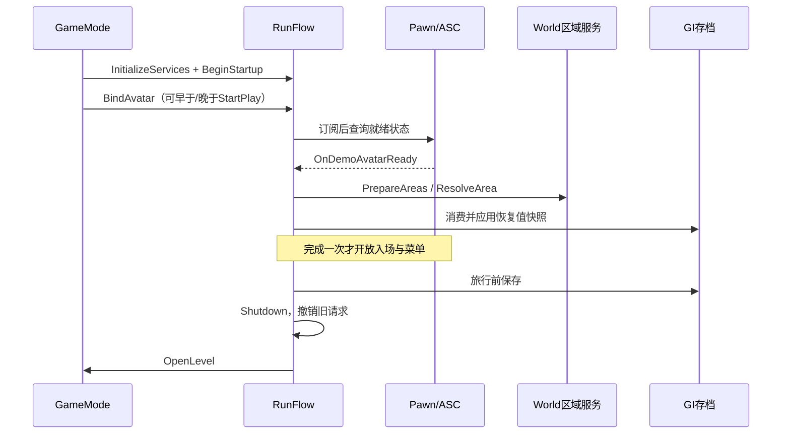
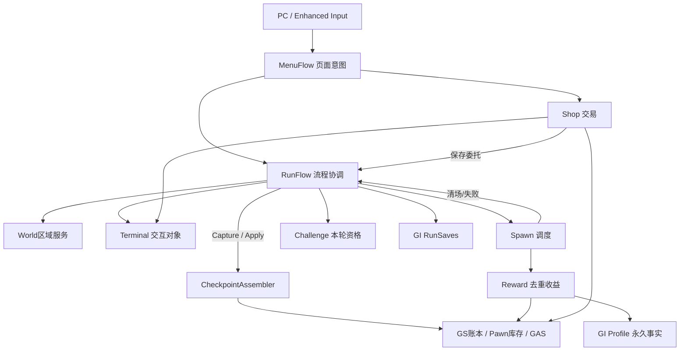

# 系统组件与职责划分

## 目的与实施状态

2026-09-22：原拆分方案已经落地。GameMode保留引擎生命周期、六个默认组件的组合和旧调用入口；流程、区域、终端、本轮挑战和本地菜单各有明确所有者。保持十关/无尽、双币、永久成长、武器/弹药解锁、检查点V5和Editor临时数据规则，不创建第二份钱包或库存。

按“谁拥有数据、需要活多久、谁执行业务”选择宿主。区域查询独立于玩法，使用WorldSubsystem；输入页面属于本地PC；长期数据属于GI；纯字段转换不使用组件。当前支持单人Standalone/单人PIE，职责拆分不等于完整联机实现。

## 挂载位置、加载与结束

| 模块 | 宿主与创建 | 职责及结束边界 |
|---|---|---|
| `UDemoRunFlowComponent` | GameMode默认子组件，随权威World创建 | RunId、就绪门控、阶段/存档/旅行编排；旅行前Shutdown，不跨World持有Actor |
| `UDemoEnemySpawnComponent` | GameMode默认子组件 | 冻结计划、队列、并发、存活登记及清场；Cancel撤销Timer/下一帧清场，不发奖励 |
| `UDemoRewardComponent` | GameMode默认子组件 | 去重击杀银币、通关金币、能力选择；Flow显式注入Spawn，EndPlay解绑 |
| `UDemoShopComponent` | GameMode默认子组件 | 报价、权限、购买；注入Terminal和保存委托，Shutdown拒绝旧交易 |
| `UDemoTerminalComponent` | GameMode默认子组件 | 两个终端成对创建/回滚/销毁，公共交互校验；Clear后可重建，Shutdown后不可重建 |
| `UDemoChallengeComponent` | GameMode默认子组件 | 本轮RunId和手枪资格；新轮重置、检查点恢复，Stop拒绝旧请求 |
| `UDemoEncounterAreaSubsystem` | 每个Game/PIE World自动创建 | 锚点弱引用注册、区域值快照、显式准备白模地形；不在Editor/预览World创建 |
| `ADemoEnemySpawnArea` | 场景Actor | 可编辑区域位置/旋转、几何、玩家/终端偏移；BeginPlay注册，EndPlay注销 |
| `UDemoMenuFlowComponent` | PlayerController默认子组件，本地PC执行 | 菜单/确认/设置/退出保存/终端会话；PC和组件EndPlay可幂等清理 |
| `DemoCheckpointAssembler` | 无状态命名空间函数 | Capture/Apply字段映射、成长和装备恢复；无磁盘/HTTP、无世界引用缓存 |
| 原有RunSaves/Profile/CloudSync | GameInstanceSubsystem | 跨地图检查点、永久事实、耐久发件箱；Editor不创建云同步，GI结束清试玩数据 |
| 原有GameState/PlayerState/Pawn | 引擎对象 | GS钱包/成长账本/显示态；PS拥有ASC；Pawn是Avatar并拥有武器/弹药组件 |

GameMode适合组合当前唯一战局的权威规则，组件无需因此反向依赖具体GM。Shop已改为注入Terminal和保存委托；Reward显式注入Spawn。未来多遭遇或多人玩法需重审遭遇Owner、个人钱包和资格归属，不能只开启复制。

参考本地Lyra的职责分层和“订阅后检查已就绪”模式；保持ASC在PS、Pawn为Avatar，不引入Experience/GameFeature插件依赖。

## 初始化、就绪与退出时序

1. World创建区域服务只初始化索引。GM/PC构造默认组件，不在构造时刷怪、交易、保存或生成地形。
2. `GameMode::StartPlay`同步加载四张表，调用Super启动场景Actor。SpawnArea登记锚点。
3. `RunFlow::InitializeServices`验证权威及同Owner依赖，安装Spawn统计/清场/失败、Reward击杀订阅及Shop保存委托；完整绑定后才开放业务初始化。
4. `HandleStartingNewPlayer`调用`BindAvatar`；角色在ASC Avatar、初始能力和武器初始化完成后广播`OnDemoAvatarReady`。Flow先订阅、再查询，因此通知早于订阅也不会遗漏。
5. `BeginStartup`只消费一次URL/待恢复检查点。等待期间组件强持有复制的值快照。当前Pawn、Controller、ASC Avatar一致、AttributeSet、武器组件及活动武器同时有效，才允许恢复。
6. 已就绪则同步完成；未就绪使用0.1秒CoreTicker检查，30秒真实时间上限，暂停不冻结。事件/Ticker共用完成门控，重复通知不换RunId、不重建库存、不重发奖励。超时留大厅显示失败，不保存半恢复数据。
7. 新档/恢复显式准备地形、验证配置和区域、创建终端、应用GAS/钱包/库存和挑战资格。Reward/Intermission重建当前关区域和奖励页面。失败清终端留大厅，原盘档保留。
8. 旅行先完成必要保存，再Shutdown：先置停止标志，撤销Ticker/Avatar委托，停资格和交易，解绑Spawn并取消调度，停终端，最后OpenLevel。旧UI不能在旅行生效前继续覆盖GI活动槽。

每个组件也在自身EndPlay清理，不假定GM、Pawn、PC和子系统的销毁顺序。跨World服务只持有值。当前资产加载是同步的；没有宣称完成任意异步资产、流送地图等待或NavMesh构建完成协议。

## 区域与终端的使用配置

拖入`ADemoEnemySpawnArea`或派生蓝图，`ArenaIndex=-1`为安全区、`0..2`为复用战斗区，同一区号只能有一个锚点。Actor位置/旋转定义地面原点，忽略缩放，偏移单位cm。

| 字段 | 默认值 | 用途 |
|---|---|---|
| CombatPlayerOffset | (-1100,0,100) | 玩家战斗入场局部偏移 |
| PreparedPlayerOffset | (-650,0,100) | 安全区/检查点入场偏移 |
| ShopOffset / NextOffset | (0,-300,0) / (0,300,0) | 升级/出发终端地面锚点 |
| Geometry | 原默认几何 | 普通半径/中心偏移、无尽外圈、Boss专用点 |

`ResolveArea`返回无Actor引用的`FDemoAreaSnapshot`。入场冻结玩家坐标和刷怪几何；清关/恢复重新解析当前区域的终端锚点。重复区号、非有限坐标、非正半径失败。未配置过锚点的区号兼容原白模位置；曾注册锚点卸载后返回Unavailable，不能悄悄回退，重新注册后恢复查询。区号应在运行前配置，运行时改动需显式重新注册。

`PrepareAreas`仅由玩法请求：四区`DemoAuthoredBlockout`+`DemoArea-1..2`标签完整时采用地图地形；部分标签缺失拒绝；完全没有才生成旧白模地板/边墙。仅追踪和回滚自己生成的物体，不销毁原地图网格。回退地形保持旧轴向固定尺寸，不为任意旋转场地自动重建墙体/NavMesh；定制区域需同步布置地形和导航。

Terminal创建前先废弃旧Generation，两个锚点分别射线找地，离地81cm生成。任意一只失败则整对撤销。清理/重建递增版本；窗口保存弱终端及打开时版本，Shop确认时重验。公共校验包含权威、当前Pawn/Controller、生命、Hub/Intermission、未暂停及250cm距离。即使站在同一位置，终端重建后也要重新交互。

Terminal不定价、不推进阶段；Shop处理购买，MenuFlow处理页面，Flow处理出发，避免服务间循环依赖。

## 刷怪、奖励和购买

`DemoSpawnPlan::Build`解析关卡/难度/怪物行形成冻结计划，不为无尽百万数量预分配Actor数组。Spawn统一调度普通/无尽，成功生成才消费队列。每5关远程加入三种小怪，每10关额外Boss；Boss优先，不占小怪名额。

GameMode蓝图`SpawnSystem → Settings`保留以下入口：

| 字段 | 默认/范围 | 用途 |
|---|---|---|
| Interval | 0.5秒 / 0.05..10 | 补怪/阻挡重试，随World暂停 |
| BatchLimit | 32 / 4..64 | 单次最大创建数 |
| CandidateAttempts | 24 / 1..64 | 每只每次最大候选数 |
| BlockedPassLimit | 60 / 1..600 | 连续阻挡上限，成功创建重置 |
| MinPlayerDistance | 450cm / 0..5000 | XY玩家安全距离 |
| MinionRows / MinionClasses | 空 | 三兵种分别覆盖数值行/派生蓝图，空采用默认 |
| BossClass | 空 | Boss派生类，空采用原生类 |

普通并发为总数量，无尽由`DT_Endless.MaxAlive`控制4..16。兵种复用`DemoEncounterRules`，碰撞重试不重新抽签。Spawn确认真实死亡并去重后才通知Reward；队列和存活均为0才排下一帧清场。取消撤销清场回调，不等于通关；异常销毁活怪失败，正常尸体销毁不重复发钱。

Reward不在BeginPlay猜测组件准备顺序。Flow显式注入Spawn，击杀发冻结银币；战役第十关按`DT_Difficulties.VictoryGoldReward`发一次金币；免费能力按RunId/关号防重。Flow推进阶段，Profile保存永久事实。

Shop不再调用具体GM取终端/存档；注入Terminal和UObject同步保存委托。确认时重验商品、阶段币种、余额、上限、报价和会话版本；同步重入门控阻止GAS回调递归购买。安全区金币为永久成长，关间银币为临时成长，两币种×三属性各自涨价。

属性购买保持“内存已生效，磁盘失败待重试”；弹药购买保持“同检查点保存失败回滚金币/解锁”。拆分没有把它们变成统一崩溃原子事务。武器通关解锁后免费装备，没有新增扣币规则；库存、各枪弹药和动画继续由Pawn组件负责。

## 流程、挑战和存档接口

- Flow沿用`StartRun / StartNextLevel / ChooseReward / NotifyPlayerDied / ContinueAfterVictory / ReturnToSafeHub / TravelToRun`命令；`SetPhase / FinishLevel / FailRun`等编排为私有。GM旧接口仅转发，方便既有UI/测试继续使用。
- 出发先完成配置/区域验证和保存，再提交关数、Combat和生成计划。非战斗阶段取消攻击、弹道和瞬时状态。死亡/放弃重置保存失败禁止旅行；通关回Hub保存失败保留内存并提示待重试。
- `DemoCheckpointAssembler::Capture/Apply`不读写磁盘，Flow调用RunSaves提交。死亡/通关/放弃清银币和临时成长；金币、永久属性、金币逐项价格、主枪/槽位、武器/弹药解锁及装配保留。本次不变更V5格式或HTTP协议。
- Challenge的`BeginRun / RestoreProgress / TryCommitWeaponShot / Stop`持有本轮资格，GS只作显示投影。空弹匣换弹不算射击、散弹一次开火只登记一次；非手枪失格不可逆，保存失败保留内存失格并拒绝该次开火。永久事实仍由Profile保存。
- 普通解锁散弹；困难/困难手枪/地狱同样解锁散弹和狙击，不补造普通通关或额外金币。困难整轮仅手枪开火解锁地狱，地狱通关解锁无尽，原双端纯规则保持。

## 菜单与输入

`UI/Flow/DemoMenuFlowComponent.h`集中状态，实现按终端、会话/设置、退出保存、弹药页分类。PC继续安装Enhanced Input、绑定Esc/快捷键并实际应用InputMode/光标/输入锁；HUD继续Canvas绘制，查询Controller兼容接口，再转发MenuFlow。

保留底层奖励/终端与顶层暂停/确认关系，不能从暂停穿透领奖。已在Hub时“返回安全区”只关闭暂停；关间/战斗有临时成长才弹放弃确认。终端销毁后关闭旧商店、撤销报价，出发确认重验版本和关号。

没有重写事件驱动HUD或通用PushPage总线。PC暂停仍执行的PlayerTick调用UpdateRealtime；退出/显示确认使用真实时间，闲置不发HTTP/写盘。15秒显示确认超时回退；取消退出后迟到云回执仅作用于GI队列，不持有PC或再次退出。Shutdown先回退未确认设置，再拒绝迟到输入。

## 日志与包体

所有新增/迁移函数、接口和回调保留`DEMO_LOG_CALL / DEMO_LOG_TICK`或等效调用日志。Editor默认完整；非Editor `LogFPSDemo / LogDemoOnline`编译上限Display，函数调用/逐帧细节不进入包体输出，不为保留埋点提升调用级别。

包体保留阶段/关卡、交易/通关、保存结果和Warning/Error。连续阻挡计数已移到日志表达式外：首次Warning、Editor逐次Log、恢复Display、最终失败摘要。不能把业务副作用放进可能裁掉的UE_LOG参数。区域查询和正常等待细节不反复Warning；不打印令牌、HTTP正文或数据库连接信息。

项目类别上限不控制引擎/第三方日志，也不是日志文件大小限制。Shipping关键日志Target配置保持；Development实测不能代替Shipping构建验收。

## 失败边界与维护

编译后原生默认组件自动生效，不要求新建蓝图。不改原UClass、表字段、武器/地图资源路径，不重导资产、不手写uasset。GI仍不持有旧World，Editor禁止云同步边界不变。

玩法提交在游戏线程；UObject委托/弱引用解决对象有效性，不代替线程边界。以后增加异步加载应引入操作版本/取消协议。当前结果沿用bool/原因文本，未实现设计稿中的全局类型化结果、完整交易撤销或导航就绪门控。

曾加载锚点丢失后新请求失败，已冻结计划不随Actor变化。真正流送地图的“等待重新加载”策略需单独实现，不能无限重试。恢复失败保留原档，可回大厅重新选槽；战斗仍保留出发检查点，只更新挑战资格，不保存半场敌人/收益。

GM转发层不再添加流程状态，PC转发层不再复制页面字段。所有出生经过Spawn登记，收益来自去重事件，购买只请求保存不能顺便推进阶段。修改这些约定时同步更新本文和对应玩法说明。

## 影响文件与验证

新增`World/DemoEncounterAreaSubsystem.*`、`Interaction/DemoTerminalComponent.*`、`Game/Flow/`、`Progression/DemoChallengeComponent.*`、`Save/DemoCheckpointAssembler.*`、`UI/Flow/`、`Tests/DemoComponentLifecycleTest.cpp`。修改GM/PC转发、角色就绪广播、SpawnArea注册、Reward/Shop依赖注入和Spawn日志。删除已迁移的`Game/DemoSessionFlow.cpp`、`Game/DemoEndlessMode.cpp`和Player目录下三个菜单实现文件。

真实白模World回归使用Editor-Cmd `-game -unattended -RenderOffscreen -nosound`，独立INI/日志，顺序运行避免AssetRegistry竞争。退出码、成功标记、失败断言均需检查；个别引擎退出路径会把测试失败转为进程0。

| 参数 | 覆盖 |
|---|---|
| `-DemoEnemyAttackTest -DemoSpawnSystemTest` | 队列/取消/阻挡，服务Owner、重复启动/通知、终端过期/部分失败回滚、锚点旋转/卸载、停止及迟到请求 |
| `-DemoSessionTest -DemoChallengeTest` | 三轮十关+无尽20关、兵种/Boss周期、手枪资格、直接困难散弹解锁、恢复/最高纪录 |
| `-DemoAmmoTest` | UI购买、取消/重复、钱包与解锁同检查点、GAS效果 |
| `-DemoSessionTest -DemoEquipmentPersistenceTest` | 死亡/放弃/磁盘恢复、主枪两槽/永久容量、新槽隔离 |
| `-DemoSessionTest -DemoVictoryContinuationTest` | 两轮战役、通关金币、逐项价格、永久/临时成长、死亡恢复 |
| `-DemoSessionTest` | 物理Esc、暂停、设置超时、存档UI、真实关间放弃确认、恢复奖励和出发 |
| `-DemoSessionTest -DemoExitSaveTest` | 本地退出保存状态、取消/迟到、写盘故障与重试 |
| `Automation RunTests FPSDemo.Debug.BuildBoundary` | Editor完整日志与命令；包体Display编译上限/调试命令缺席 |

日志统一为`Saved/Logs/ComponentMigration*.log`，结果详见[调试与验证](调试与验证.md)。Editor仅本地临时数据，无云子系统。旧`Systems*.log`是上一轮三系统重构记录，不能替代本次验证。人工手感、完整Shipping、多人、高关数性能和真实云端仍需单独验收。
